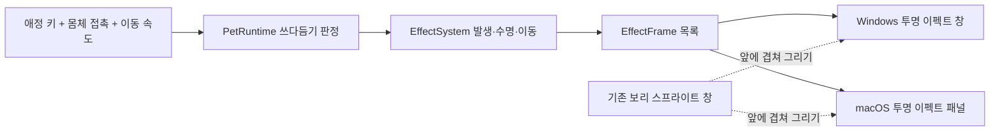

# 쓰다듬기 하트와 공통 이펙트 구조

상태: 2026-09-22 설계 승인 후 구현·Windows 전체 검증·실행 확인 완료. Windows 실사용은 사용자 승인 완료. macOS 컴파일·실화면은 별도 확인 대상이다.
작업 위치: `Roamling-petting-effects`, 브랜치 `feat/petting-effects`.

## 목표와 이번 범위

보리 스프라이트는 그대로 두고 그 앞·위에 작은 하트가 떠오르게 한다. 같은 구조에 다른 모양과
발생 조건을 추가할 수 있게 하되 외부 플러그인, 편집기, 스크립트 언어, 새 의존성은 만들지 않는다.
이번 구현은 공통 코어와 Windows·macOS 데스크톱 렌더러다. Android 제스처·그리기는 후속 작업이다.

## 연결 지점 — 코드로 확인한 사실

| 단계 | 현재 구현 |
|---|---|
| 쓰다듬기 판별 | `rust/roamling-core/src/pet_runtime.rs`의 `finish_tick`: 애정 키와 몸체 위 커서가 함께 있으면 `is_petted`, 움직임으로 `petting_animation_rate`를 갱신한다 |
| 그림 선택 | 같은 파일 `current_capability` → `capability_for`: 쓰다듬는 `LookAtPointer`는 `Paw`. 승인 대기도 `Paw`이므로 capability만 보고 하트를 만들면 안 된다 |
| Windows 그림 | `rust/roamling-win/src/main.rs`의 `draw`: 펫 크기만큼의 `Surface`에 현재 셀을 복사하고 중심 좌표로 표시한다. `sprite.rs`의 `Surface::draw_frame`이 실제 픽셀 복사를 한다 |
| Windows 입력 | `main.rs`의 `tick`이 몸체 범위로 `pointer_is_over_pet`을 계산한다. 이펙트 영역을 이 범위에 더하면 쓰다듬기와 클릭 판정이 바뀐다 |
| macOS 그림·입력 | `Sources/RoamlingMac/PetOverlayPanel.swift`의 `PetOverlayView.draw`·`containsPet`·`MacOverlayProvider.objectSize`: 현재 뷰 크기와 몸체 영역이 연결되어 있다 |
| macOS 전달 | `Sources/RoamlingEngine/RoamlingRuntime.swift`의 tick이 `locomotionRate`로 프레임을 진행하고 `renderCurrentFrame`을 호출한다. `PlatformServices.swift`의 `PetOverlayProviding`이 오버레이 계약이다 |
| 공통 FFI | `rust/roamling-core/src/ffi/runtime.rs`의 `PetLoop`·`FfiTickOutput`; Swift와 별도 저장소의 Android가 함께 쓴다(`docs/android.md`) |

## 구현 흐름

구현은 아래 파일과 타입에 있다. 사용자 승인 이후 도형 전달은 플랫폼별 모양 분기 대신 공통 폴리곤으로 구체화했다.

- `effects.rs / EffectSystem`: 제한된 수의 입자, 시간 진행, 발생 간격, 수명 종료를 관리한다.
  `EffectDefinition`에 모양·색·수명·시작/종료 크기·상승 속도를 두고 `Particle`이 나이·가로 위치·흐름을 가진다.
- `EffectFrame`: 펫 중심 기준의 채워진 폴리곤 좌표·RGB·투명도를 전달한다. 좌표 단위는 펫 너비, y는 아래 방향이다.
  첫 모양은 `Shape::Heart`다. 코어에 다른 폴리곤을 추가하면 플랫폼별 그리기 코드는 그대로 재사용한다.
- `PetRuntime`은 **실제로 쓰다듬는 상태**에서만 하트 발생기를 켠다.
  승인 대기·커서 근처의 일반 응시·잡기·드래그에는 하트가 나오지 않는다.
- 기존 행동 난수와 독립된 입자 순번/시드를 사용한다. 하트 때문에 산책 목적지나 행동 시간이 달라지지 않는다.
- 입자 위치는 펫 크기에 대한 상대 좌표로 두어 펫 종류·색·배율에 관계없이 같은 연출을 사용한다.

## 첫 하트 연출의 기본값

- 쓰다듬기 약 0.35초 후 첫 작은 분홍 하트가 머리 주변에 나타난다.
- 손이 멈춰 있으면 약 0.7초 간격, 빠르게 쓰다듬으면 약 0.2초 간격으로 발생한다.
- 하트는 약 1.2초 동안 조금 커지며 펫 너비의 0.60배/초 속도로 위로 떠올라 투명해진다. 동시 표시는 최대 6개다.
- 손을 떼면 새 하트는 멈추고 남은 하트만 사라진다. 숨기기·펫 변경·종료에는 즉시 비운다.
- 이 수치는 체감 조정용 첫 값이다. 소리·화면 흔들림·반짝임은 넣지 않는다.

## 렌더링과 API 경계

**펫 창을 확대하지 않고 별도의 입력 통과 이펙트 창을 쓴다.** 머리 위로 뜨는 하트가 잘리지 않으면서
기존 잡기 영역·배치 충돌 크기·스프라이트 캐시를 유지할 수 있다. 비용은 플랫폼마다 투명 창 하나와
동기화 코드가 추가되는 것이다.

- Windows: 비활성·입력 통과 layered window 하나에 입자를 한꺼번에 그린다.
  펫 창과 함께 이동·표시·숨김·DPI 변경·종료를 처리하고 위아래 순서도 함께 유지한다.
  `main.rs::draw`와 `sprite.rs::Surface` 연결부에서 펫과 이펙트 캐시를 분리한다.
- macOS: 입력을 받지 않는 투명 `NSPanel`을 펫 패널에 연결하고 보리 앞에 표시한다.
  `MacOverlayProvider`가 위치·배율·숨김·Spaces 수명을 함께 관리한다.
- 하트는 코드로 그리는 작은 도형이다. 캐릭터 아틀라스를 수정하거나 하트를 스프라이트에 구워 넣지 않는다.
- **추가된 FFI:** `PetLoop.effect_frames()`와 새 `FfiEffectFrame` 자료형을 추가한다.
  기존 `FfiTickInput`·`FfiTickOutput` 필드와 기존 메서드 인자는 유지한다.
  Swift `RustCore.swift` 래퍼와 `PetOverlayProviding`에는 효과 전달 경로를 추가한다.
  Android의 고정된 코어 버전은 그대로 두며, 나중에 올릴 때 바인딩 재생성·Android 빌드를 별도 검증한다.
- 생성된 UniFFI 파일은 손으로 편집하지 않는다. 새로 추가되는 공개 표면은 위 경계까지다.

## 검증과 완료 조건

- 코어: 승인 대기에는 하트 없음, 쓰다듬기만 발생, 이동량에 따른 빈도, 최대 개수·수명,
  종료 후 소멸, 숨김 후 잔상 없음, 30/60Hz 차이 허용 범위, 행동 난수 독립성을 확인한다.
- 렌더러: 투명도 합성, 머리 위 잘림, 프레임 정지 중에도 하트 진행, 크기·DPI·다중 모니터 이동,
  하트 위 클릭이 밑의 앱으로 통과하는지 확인한다. 기존 클릭·드래그·숨기기 동작을 보존한다.
- Windows는 `scripts/test.ps1`과 실행 검증 후 사용자가 체감을 확인한다.
- macOS는 이 Windows 호스트에서 실행 검증할 수 없다. Swift 하네스·서명 빌드·실제 패널 확인을 별도 게이트로 남긴다.
- 픽스처·기존 녹화는 통과를 위해 재생성하지 않는다. 하트가 행동을 바꿨다면 원인을 수정한다.

## 확장하는 곳

1. 새 모양·색·수명·크기는 `rust/roamling-core/src/effects.rs`의 `Shape`·`EffectDefinition`에 추가한다.
   `frames`는 해당 모양을 폴리곤으로 해석한다. 시간 진행·수명 종료·최대 개수 제한은 공통으로 사용한다.
2. 새 발생 조건은 `PetRuntime::finish_tick`에서 상태를 명시해 연결한다. 현재 `EffectSystem::update`는
   쓰다듬기 발생기의 시간표를 함께 관리하며, 다른 이벤트를 붙일 때 발생기 정책을 이곳에 더한다.
   capability 하나로 조건을 추정하지 않는다. 새 코어 효과는 행동용 RNG를 빌리지 않는다.
3. 양쪽 렌더러는 폴리곤 합성이므로 기존 RGB+투명도 도형이라면 바꿀 필요가 없다.
   텍스처·후처리 같은 새 표현이 필요할 때만 그리기 계약을 별도로 검토한다.

## 승인·검증 기록

- 2026-09-22 사용자 “응 좋아 진행”으로 이 문서의 구조·FFI 추가 범위를 승인했다.
- `EffectSystem` 테스트는 30/60Hz, 빈도 차이, 최대 개수, 소멸, 짧은 접촉을 확인한다.
- `movement_policy_tests`는 입력 대기에 하트가 없는지, 실제 접촉과 숨김·펫 교체의 경계를 확인한다.
- Windows `effects::tests`는 실제 창의 owner, 입력 통과·비활성 스타일, 크기 변경과 수명을 확인한다.
  `sprite::effect_tests`는 투명 여백·premultiplied 합성과 빈 프레임의 잔상 제거를 확인한다.
- `ROAMLING_EFFECTS_PREVIEW=<BMP 경로>`로 `preview_pet_with_hearts` 테스트를 실행하면
  실제 캐릭터 샘플러와 효과 합성기를 사용한 이미지를 얻는다. 아틀라스는 변경하지 않는다.
- Swift 바인딩 생성이 성공했다(`output/swift-effects`). macOS 컴파일·패널 육안 확인은 미검증이다.
- `scripts/test.ps1` 전체 통과: 코어 96개·Windows 셸 60개(기존 네트워크 1개 ignored), differential·릴리스 빌드 포함.
  `output/petting-hearts.png` 합성 샘플을 육안 확인했고 실행 smoke는 exit 0. 워크트리 실행본을 다시 켰다.
  검증 상세와 실사용 확인 상태는 `docs/requests.md` R25에 있다.
