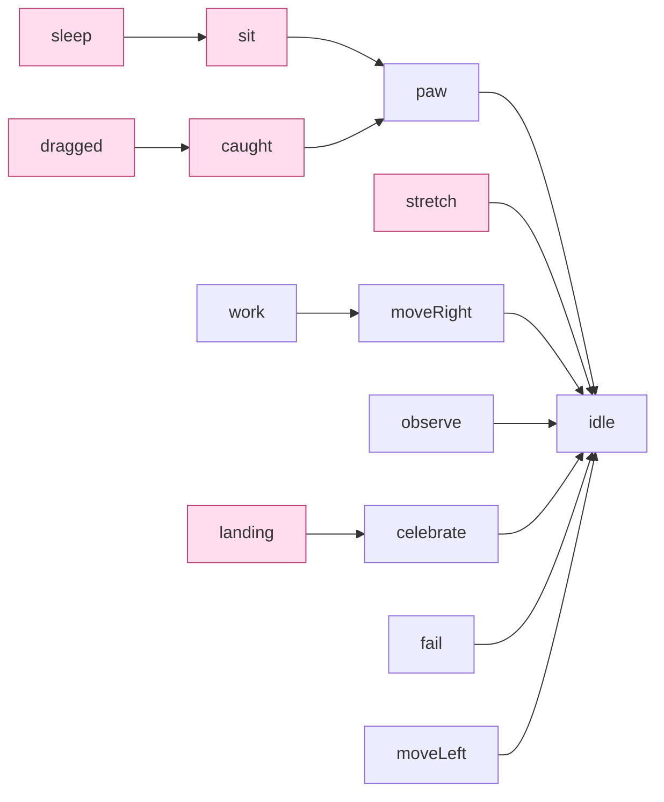

# Pets: what Roamling needs, what Petdex gives, and what it borrows

`docs/architecture.md`는 모듈 경계를, `docs/art/mochi-animation-handoff.md`는 프레임을
어떻게 그리는지를 다룬다. 이 문서는 그 사이다 — **Roamling이 요구하는 동작 목록과 펫
패키지가 실제로 담고 있는 것 사이의 간격**, 그리고 그 간격을 무엇으로 메우는가.

만든 이유는 하나다. 2026-08-30에 "펫이 잠을 안 잔다"를 한 시간 넘게 쫓았는데, 상태기는
정상적으로 잠들고 있었고 **선택된 패키지에 잠자는 그림이 없었을 뿐**이었다. 더 정확히는
그 패키지가 애니메이션을 하나만 선언해서 **모든 상태가 같은 5프레임 루프로 떨어지고
있었다.** 밖에서는 보이지 않았고, 코드 어디에도 그 사실을 말해주는 곳이 없었다.

## 1. Roamling이 요구하는 것 — capability 14종

`BehaviorState`(무엇을 하는 중인가)와 `PetCapability`(무엇을 보여줄 것인가)는 다른
축이다. 상태는 14개보다 많고, 여럿이 한 capability로 모인다.

| capability | 어떤 상태에서 오는가 |
|---|---|
| `idle` | `.idle` |
| `moveLeft` / `moveRight` | `.wander` · `.evadePointer` · `.findSleepSpot` · `.travelToInterest` — 진행 방향으로 갈림 |
| `sit` | `.sit` (쉬기 직전 앉는 구간) |
| `sleep` | `.sleep` |
| `stretch` | `.stretch` · `.wake` |
| `observe` | `.observe` · `.lookAtPointer` |
| `work` | `.work` |
| `paw` | `.waitingForUser` |
| `celebrate` | `.celebrate` |
| `fail` | `.sad` |
| `caught` | `.caught`, 그리고 `.dragged`의 전환 구간 |
| `dragged` | `.dragged` |
| `landing` | `.dropped` |

`PetCapabilityMapping`은 일부러 exhaustive switch다. `BehaviorState`에 case를 추가하면
빌드가 깨진다. 조용히 `.idle`로 떨어지는 걸 한 번 겪었기 때문이다 — `travelToInterest`가
idle 프레임으로 화면을 가로질러 미끄러졌다.

## 2. Petdex/Codex가 주는 것 — state 9종

Petdex의 [`pet-states.ts`](https://github.com/crafter-station/petdex)가 9개 row를
canonical table로 둔다. `hatch-pet` 스킬도 같은 문장을 쓴다 — *"The Codex app contract
currently uses all 9 states."*

```text
idle · running-right · running-left · waving · jumping · failed · waiting · running · review
```

- **격자** v1 = 8열 × 9행, v2 = 8열 × 11행(뒤 2행은 16방향 look pose, 22.5° 간격)
- **셀** 192 × 208 (v1 시트는 1536 × 1872)
- **검증** `submissions-validation.ts`가 8×9 또는 8×11의 **정확한 비율**을 요구한다
- **alias** Codex `model.rs`가 `move_right` · `move_left` · `wave` · `bounce` · `sad`를 받는다

이름은 패키지마다 제각각이 아니다. **고정된 어휘고 Roamling resolver도 그 어휘와 alias를
그대로 알고 있다.**

## 3. 차이 — 어휘가 아니라 개념이다

9종은 **에이전트 활동 상태**다. `running`은 달리기가 아니라 "작업 중"이고, `review`는
검토, `waiting`은 승인 대기, `failed`는 실패다. 터미널 한 구석에 사는 펫에게 필요한
전부다.

Roamling의 펫은 **데스크탑에 산다.** 낮잠을 자고, 앉아서 쉬고, 기지개를 켜고, 손으로
집어 올릴 수 있다. Codex 펫에는 그런 개념이 아예 없다.

```text
Petdex 9종이 채우는 것              Roamling 전용 (규격에 개념이 없음)
  idle          → idle                sit
  running-right → moveRight           sleep
  running-left  → moveLeft            stretch
  running       → work                caught / dragged
  review        → observe             landing
  waiting       → paw
  waving        → celebrate
  jumping       → celebrate
  failed        → fail
```

**그리고 격자에 빈자리가 없다.** v1의 9행은 9종이 한 행씩 차지하고, v2의 11행은 거기에
look pose 2행이 붙는다. 행을 하나 더 붙이면 8×9/8×11 비율 검증을 통과하지 못한다.
즉 규격을 지키는 어떤 Petdex 펫도 **영원히 그 5종을 갖지 못한다.** 패키지가 부실한 게
아니라 규격이 다른 것을 겨냥한다.

## 4. 그래서 빌려온다 — 사슬과 출처

capability마다 이름 목록을 평면으로 두면, 대체를 하나 개선해도 다른 곳에 전파되지 않고
같은 폴백을 열네 번 반복해 적게 된다. 그래서 각 capability는 **자기가 무엇으로
degrade되는지**를 지목하고, 이름 목록에는 **그 capability를 뜻하는 이름만** 둔다.
빌려온 것은 전부 사슬을 통해 도착하므로 출처가 정직하게 남는다.



분홍이 Petdex 규격에 없어서 항상 빌려오는 것들이다. `sit`에 앉은 자세 하나를 알려주면
`sleep`과 `caught`가 같이 좋아진다 — 그게 사슬을 쓰는 이유다.

`resolution(_:)`은 트랙과 함께 출처를 돌려준다.

| 출처 | 뜻 |
|---|---|
| `authored` | 패키지가 그 capability를 자기 이름으로 갖고 있다 |
| `substituted(X)` | X의 그림을 빌려 쓴다. 규격상 예정된 일이지 결함이 아니다 |
| `placeholder` | 관련된 게 아무것도 없어 마지막 수단으로 떨어졌다. **이게 보이면 패키지를 의심한다** |

`placeholder`를 없애지 않고 남긴 이유는, 없애면 펫이 아예 안 그려지기 때문이다. 대신
메뉴에 드러낸다. **오늘 문제는 대체가 일어난 게 아니라 대체가 일어난 걸 아무도 몰랐던
것이다.**

### 대체를 고를 때의 기준

두 번 틀렸고 두 번 다 실제로 움직이는 걸 보고 고쳤다. 남길 만한 교훈이 있다.

- **루프인지 아닌지가 자세보다 중요할 때가 있다.** `caught`에 `jumping`을 붙였더니
  커서가 들고 다니는 내내 반복 재생돼서, 잡힌 게 아니라 제 발로 통통 뛰는 걸로 읽혔다.
  앉아서 위를 올려다보는 `waiting`이 "잡은 손을 쳐다보는" 그림이 되어 훨씬 낫다.
- **`landing`은 반대다.** 착지는 진짜로 hop이라 `jumping`이 맞다.
- 승인 기록의 설명만 읽고 고르지 말 것. 실제로 재생해봐야 한다.

## 5. 실측 커버리지

```text
FatMochi (내장, 8×7)        authored 14 / 대체 0
  트랙: caught · dragged · sitting · sleeping · stretching · landing ·
        idle · running-left/right · failed · jumping · review · running ·
        waiting · watching · waving · working

Mochi (내장, 9행)           authored  9 / 대체 5
  대체: caught · dragged · sit · sleep · stretch

Mochi (외부 패키지, 8×9)     authored  8 / 대체 6
  대체: 위 5종 + landing
```

FatMochi만 완전한 이유는 **Petdex 규격을 따르지 않기 때문이다.** 8×7에 Roamling 자체
행 배치를 쓰고, 없는 에이전트 상태(review·waiting·jumping 등)는 팩토리가 idle과 걷기에서
합성해 채운다. 정확히 반대편이 비어 있고, 그 반대편은 합성으로 메울 수 있다.

**자는 그림·잡히는 그림이 진짜인 펫은 지금 FatMochi뿐이다.**

## 6. Roamling 전용 펫을 만든다면

Petdex 호환을 유지하면서 잠을 넣는 방법은 없다. 행이 남지 않는다. 그래서 선택은 둘이다.

| | Petdex 규격 그대로 | Roamling 확장 |
|---|---|---|
| 격자 | 8×9 또는 8×11 | 자유 (`frame`으로 선언) |
| 갤러리 제출 | 가능 | 불가 |
| sleep·sit·stretch·caught | 영구 대체 | 진짜 그림 |
| 만드는 비용 | 9행 | 13~14행 |

확장을 고른다면 이렇게 구성하는 걸 권한다. 앞 9행을 규격 순서 그대로 두는 것이 핵심이다 —
그러면 같은 시트를 잘라 Petdex용 8×9를 그대로 뽑아낼 수 있다.

```text
row  0  idle            ┐
row  1  running-right   │
row  2  running-left    │
row  3  waving          │ Petdex 9종, 순서 유지
row  4  jumping         │ (여기까지 잘라내면 그대로 규격 패키지)
row  5  failed          │
row  6  waiting         │
row  7  running         │
row  8  review          ┘
row  9  sleeping        ┐ Roamling 전용
row 10  sitting         │ sitting이 있으면 sleep 대체도 같이 좋아진다
row 11  stretching      │
row 12  caught          │ dragged는 caught에서 degrade되므로 선택
row 13  landing         ┘ jumping과 충분히 다르면 그릴 값어치가 있다
```

우선순위는 **sleeping → sitting → caught → stretching → landing** 순이다. 앞의 둘이
체감이 가장 크고(펫이 하루 대부분을 쉬면서 보낸다), landing은 `jumping`으로 대체해도
크게 어색하지 않다.

### 매니페스트

`pet.json`은 Codex `model.rs`가 decode하는 모양 그대로다. 프레임 인덱스는 `row * columns
+ column`이고, **인덱스를 반복해 정지 구간을 만들 수 있다.** 승인된 `review` 루프가 이미
그 방식을 쓴다.

```json
{
  "id": "mochi",
  "displayName": "Mochi",
  "description": "…",
  "spritesheetPath": "spritesheet.webp",
  "frame": { "width": 192, "height": 208, "columns": 8, "rows": 14 },
  "animations": {
    "idle":     { "frames": [0,0,0,0,0,0,0,0,0,0,0,0,1,2,3,4,5], "fps": 10, "loop": true },
    "sleeping": { "frames": [72,73,74,75], "fps": 2, "loop": true },
    "landing":  { "frames": [104,105,106,107], "fps": 12, "loop": false }
  }
}
```

- `loop: false`는 한 번만 재생하고 마지막 프레임에 머문다. 착지·잡힘처럼 **되돌아오지
  않는 동작**에 쓴다. 잡힌 채로 들려 다니는 `dragged`는 반대로 루프여야 한다.
- `fallback`으로 다른 트랙 이름을 지목할 수 있다. 프레임이 빈 트랙은 fallback을 따라간다.
- 선언하지 않은 행은 **존재하지 않는 것과 같다.** 오늘의 사건이 정확히 이것이었다.

### 그림 규칙

`docs/art/mochi-animation-handoff.md`의 불변식이 그대로 적용된다. 요약하면:

- 프레임마다 **전신을 한 장으로** 새로 그린다. 눈·발만 생성해 붙이는 patch 금지
- 한 strip 안에서 canvas·scale·ground line·body center 고정
- 프레임의 visible pixel은 하나의 connected component. 떨어진 조각이 있으면 수선하지
  말고 그 프레임을 재제작한다
- 왼쪽 걷기는 승인된 오른쪽의 full-frame mirror

같은 문서 109행에 **SLEEP strip 프롬프트가 이미 적혀 있다** — 4프레임, 웅크린 자세,
눈 감은 채 들숨/날숨, 지면 접촉 고정.

### PixelLab을 쓴다면

`CLAUDE.md`가 다음 펫부터 검토하기로 적어둔 경로다. 여기 적힌 결함들의 원인이 **strip
분할 → 재중앙정렬** 단계였고, PixelLab은 프레임 단위로 받으므로 그 단계가 사라진다.

- 구독 없이 USD credit 종량제. `GET /balance`가 credit과 subscription을 따로 준다
- **무료 티어는 생성 해상도 상한 200×200이라 192×208 셀에 세로가 모자란다.** padding
  전략을 미리 정하거나 Tier 1($12/월, 320×320)부터 쓴다
- 프레임을 개별로 받더라도 **ground line과 body center는 여전히 우리 책임이다.**
  합성 전에 프레임별 baseline을 맞추고, alpha connected component를 검사한다

### 확인

- **메뉴 → 펫** 에 로드된 펫의 커버리지가 뜬다. `대체 불가`가 보이면 매니페스트를 의심한다
- 상태를 하나씩 눈으로 확인하기 어려우면 **메뉴 → 진단 기록 복사**로 `pet` 카테고리 전이를
  본다. 상태는 도는데 그림이 안 바뀌는 상황이 이걸로 드러난다
