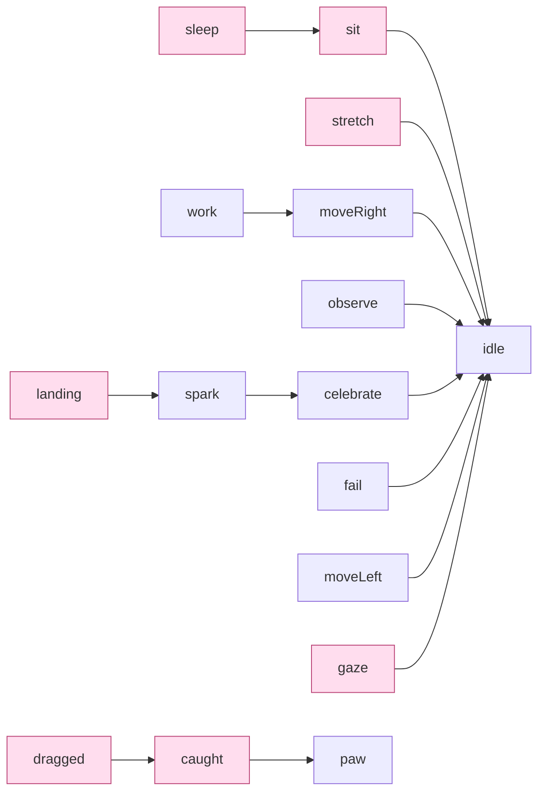

# Pets: what Roamling needs, what Petdex gives, and what it borrows

`docs/architecture.md`는 모듈 경계를, `docs/art/mochi-animation-handoff.md`는 프레임을
어떻게 그리는지를 다룬다. 이 문서는 그 사이다 — **Roamling이 요구하는 동작 목록과 펫
패키지가 실제로 담고 있는 것 사이의 간격**, 그리고 그 간격을 무엇으로 메우는가.

만든 이유는 하나다. 2026-08-30에 "펫이 잠을 안 잔다"를 한 시간 넘게 쫓았는데, 상태기는
정상적으로 잠들고 있었고 **선택된 패키지에 잠자는 그림이 없었을 뿐**이었다. 더 정확히는
그 패키지가 애니메이션을 하나만 선언해서 **모든 상태가 같은 5프레임 루프로 떨어지고
있었다.** 밖에서는 보이지 않았고, 코드 어디에도 그 사실을 말해주는 곳이 없었다.

## 1. Roamling이 요구하는 것 — capability 16종

`BehaviorState`(무엇을 하는 중인가)와 `PetCapability`(무엇을 보여줄 것인가)는 다른
축이다. 상태는 16개보다 많고, 여럿이 한 capability로 모인다.

| capability | 어떤 상태에서 오는가 | Petdex 행 |
|---|---|---|
| `idle` | `.idle` | `idle` |
| `moveLeft` / `moveRight` | `.wander` · `.evadePointer` · `.findSleepSpot` · `.travelToInterest` — 진행 방향으로 갈림 | `running-left/right` |
| `sit` | `.sit` (쉬기 직전 앉는 구간) | — |
| `sleep` | `.sleep` | — |
| `stretch` | `.stretch` · `.wake` | — |
| `observe` | `.observe` — 파일을 읽거나 검색하는 중 | `review` |
| `gaze` | `.lookAtPointer` — 커서가 가까이 왔다 | — |
| `work` | `.work` | `running` |
| `paw` | `.waitingForUser` | `waiting` |
| `spark` | `.spark` — 턴이 시작됐다 | `jumping` |
| `celebrate` | `.celebrate` — 턴이 끝났다 | `waving` |
| `fail` | `.sad` | `failed` |
| `caught` | `.caught`, 그리고 `.dragged`의 전환 구간 | — |
| `dragged` | `.dragged` | — |
| `landing` | `.dropped` | — |

오른쪽 열이 빈 일곱이 Petdex에 개념이 없는 Roamling 확장이다. 나머지 아홉은 Petdex 행
하나를 그대로 뜻하고, **그 뜻은 우리가 정하지 않는다** — `docs/state-contract.md` 참조.

`PetCapabilityMapping`은 일부러 exhaustive switch다. `BehaviorState`에 case를 추가하면
빌드가 깨진다. 조용히 `.idle`로 떨어지는 걸 한 번 겪었기 때문이다 — `travelToInterest`가
idle 프레임으로 화면을 가로질러 미끄러졌다.

## 2. Petdex/Codex가 주는 것 — state 9종

Petdex의 [`pet-states.ts`](https://github.com/crafter-station/petdex)가 9개 row를
canonical table로 둔다. `hatch-pet` 스킬도 같은 문장을 쓴다 — *"The Codex app contract
currently uses all 9 states."*

```text
idle · running-right · running-left · waving · jumping · failed · waiting · running · review
```

- **격자** v1 = 8열 × 9행, v2 = 8열 × 11행(뒤 2행은 16방향 look pose, 22.5° 간격)
- **셀** 192 × 208 (v1 시트는 1536 × 1872)
- **검증** `submissions-validation.ts`가 8×9 또는 8×11의 **정확한 비율**을 요구한다
- **alias** Codex `model.rs`가 `move_right` · `move_left` · `wave` · `bounce` · `sad`를 받는다

이름은 패키지마다 제각각이 아니다. **고정된 어휘고 Roamling resolver도 그 어휘와 alias를
그대로 알고 있다.**

## 3. 차이 — 어휘가 아니라 개념이다

9종은 **에이전트 활동 상태**다. `running`은 달리기가 아니라 "작업 중"이고, `review`는
검토, `waiting`은 승인 대기, `failed`는 실패다. 터미널 한 구석에 사는 펫에게 필요한
전부다.

Roamling의 펫은 **데스크탑에 산다.** 낮잠을 자고, 앉아서 쉬고, 기지개를 켜고, 손으로
집어 올릴 수 있다. Codex 펫에는 그런 개념이 아예 없다.

```text
Petdex 9종이 채우는 것              Roamling 전용 (규격에 개념이 없음)
  idle          → idle                sit
  running-right → moveRight           sleep
  running-left  → moveLeft            stretch
  running       → work                gaze   (커서 응시)
  review        → observe             caught / dragged
  waiting       → paw                 landing
  jumping       → spark  (턴 시작)
  waving        → celebrate (턴 완료)
  failed        → fail
```

`jumping`과 `waving`을 눈여겨볼 것. **`jumping`은 축하가 아니라 시작 신호고, 완료 신호는
`waving`이다.** 둘을 뒤집어 두면 규격대로 그려진 모든 펫에서 완료 축하가 시작 그림으로
나온다. 실제로 그랬고, `docs/state-contract.md`가 그걸 고친 기록이다.

**그리고 행 단위로는 격자에 빈자리가 없다.** v1의 9행은 9종이 한 행씩 차지하고, v2의
11행은 거기에 look pose 2행이 붙는다. 행을 하나 더 붙이면 8×9/8×11 비율 검증을 통과하지
못한다.

**셀 단위로는 남는다.** 대부분의 행이 8칸을 다 쓰지 않는다 — 현재 Mochi 패키지 기준으로
15칸이 비어 있다. 다만 확장은 그 칸이 아니라 **`roamling.json`이 가리키는 자기 시트**에
두는 편이 낫다 — `pet.json`과 `spritesheet.webp`가 9행 계약 그대로 남고, 확장이 15칸에
묶이지도 않는다.

## 4. 그래서 빌려온다 — 사슬과 출처

capability마다 이름 목록을 평면으로 두면, 대체를 하나 개선해도 다른 곳에 전파되지 않고
같은 폴백을 열네 번 반복해 적게 된다. 그래서 각 capability는 **자기가 무엇으로
degrade되는지**를 지목하고, 이름 목록에는 **그 capability를 뜻하는 이름만** 둔다.
빌려온 것은 전부 사슬을 통해 도착하므로 출처가 정직하게 남는다.



분홍이 Petdex 규격에 없어서 항상 빌려오는 것들이다. `sit`에 앉은 자세 하나를 알려주면
`sleep`과 `caught`가 같이 좋아진다 — 그게 사슬을 쓰는 이유다.

`resolution(_:)`은 트랙과 함께 출처를 돌려준다.

| 출처 | 뜻 |
|---|---|
| `authored` | 패키지가 그 capability를 자기 이름으로 갖고 있다 |
| `substituted(X)` | X의 그림을 빌려 쓴다. 규격상 예정된 일이지 결함이 아니다 |
| `placeholder` | 관련된 게 아무것도 없어 마지막 수단으로 떨어졌다. **이게 보이면 패키지를 의심한다** |

`placeholder`를 없애지 않고 남긴 이유는, 없애면 펫이 아예 안 그려지기 때문이다. 대신
메뉴에 드러낸다. **오늘 문제는 대체가 일어난 게 아니라 대체가 일어난 걸 아무도 몰랐던
것이다.**

### 대체를 고를 때의 기준

두 번 틀렸고 두 번 다 실제로 움직이는 걸 보고 고쳤다. 남길 만한 교훈이 있다.

- **루프인지 아닌지가 자세보다 중요할 때가 있다.** `caught`에 `jumping`을 붙였더니
  커서가 들고 다니는 내내 반복 재생돼서, 잡힌 게 아니라 제 발로 통통 뛰는 걸로 읽혔다.
  앉아서 위를 올려다보는 `waiting`이 "잡은 손을 쳐다보는" 그림이 되어 훨씬 낫다.
- **`landing`은 반대다.** 착지는 진짜로 hop이라 `jumping`이 맞다. 그래서 `landing`은
  `celebrate`가 아니라 `spark`(= `jumping`)에서 빌린다. 이름이 아니라 **어떤 뜻을 빌리는지**
  를 코드에 적어야 하는 이유가 이것이다 — `celebrate`를 `waving`으로 고치는 순간, 사슬로만
  이어져 있던 착지가 작별 인사로 바뀔 뻔했다.
- 승인 기록의 설명만 읽고 고르지 말 것. 실제로 재생해봐야 한다.

## 5. 실측 커버리지

```text
FatMochi (내장, 8×7)        authored 16 / 대체 0
  트랙: caught · dragged · sitting · sleeping · stretching · landing ·
        idle · running-left/right · failed · celebrate · jumping · review ·
        running · waiting · watching · waving · working

Mochi (내장, 9행)           authored 10 / 대체 6
  대체: caught · dragged · gaze · sit · sleep · stretch

Mochi (외부 패키지, 8×9)     authored  9 / 대체 7
  대체: 위 6종 + landing
```

FatMochi만 완전한 이유는 **Petdex 규격을 따르지 않기 때문이다.** 8×7에 Roamling 자체
행 배치를 쓰고, 없는 에이전트 상태(review·waiting·jumping 등)는 팩토리가 idle과 걷기에서
합성해 채운다. 정확히 반대편이 비어 있고, 그 반대편은 합성으로 메울 수 있다.

**자는 그림·잡히는 그림이 진짜인 펫은 지금 FatMochi뿐이다.**

## 6. Roamling 전용 펫을 만든다면

선택은 셋이다. 가운데가 나중에 생겼고, 대개 그게 맞다.

| | Petdex 규격 그대로 | 빈 셀 + `roamling.json` v2 | 행을 늘린 Roamling 확장 |
|---|---|---|---|
| 격자 | 8×9 또는 8×11 | **8×9 그대로** | 자유 (`frame`으로 선언) |
| 갤러리 제출 | 가능 | **가능** (`pet.json`이 규격 그대로) | 불가 |
| sleep·sit·gaze·caught | 영구 대체 | 진짜 그림 (칸이 닿는 만큼) | 진짜 그림 |
| 만드는 비용 | 9행 | 9행 + 빈 셀 11~15칸 | 14~15행 |

가운데 방식은 표준 9행이 쓰지 않는 셀에 그림을 넣고, 그 인덱스를 `roamling.json`의
`animations`로 선언한다. 격자가 안 변하므로 Petdex 검증을 통과하고, Codex는 선언하지 않은
이름을 그냥 보지 못한다. 현재 Mochi 패키지에는 그런 셀이 15칸 있다.

행까지 늘린다면 이렇게 구성하는 걸 권한다. 앞 9행을 규격 순서 그대로 두는 것이 핵심이다 —
그러면 같은 시트를 잘라 Petdex용 8×9를 그대로 뽑아낼 수 있다.

```text
row  0  idle            ┐
row  1  running-right   │
row  2  running-left    │
row  3  waving          │ Petdex 9종, 순서 유지
row  4  jumping         │ (여기까지 잘라내면 그대로 규격 패키지)
row  5  failed          │
row  6  waiting         │
row  7  running         │
row  8  review          ┘
row  9  sleeping        ┐ Roamling 전용
row 10  sitting         │ sitting이 있으면 sleep 대체도 같이 좋아진다
row 11  gaze            │ 커서를 오래 응시하는 그림. Petdex에 개념이 없다
row 12  stretching      │
row 13  caught          │ dragged는 caught에서 degrade되므로 선택
row 14  landing         ┘ jumping과 충분히 다르면 그릴 값어치가 있다
```

우선순위는 **sleeping → sitting → gaze → caught → stretching → landing** 순이다. 앞의
둘이 체감이 가장 크고(펫이 하루 대부분을 쉬면서 보낸다), `gaze`는 커서가 다가올 때마다
쓰이므로 빈도가 높다. landing은 `jumping`으로 대체해도 크게 어색하지 않다.

### 매니페스트

`pet.json`은 Codex `model.rs`가 decode하는 모양 그대로다. 프레임 인덱스는 `row * columns
+ column`이고, **인덱스를 반복해 정지 구간을 만들 수 있다.**

**단 그 트릭이 통하는 곳은 Roamling과 Codex뿐이다.** Petdex 데스크탑 렌더러
(`sprite.zig`)는 매니페스트 타이밍을 읽지 않고 행마다 고정된 프레임 수와 길이로 **앞
N칸만** 재생한다.

```text
idle 6 · running-right 8 · running-left 8 · waving 4 · jumping 5
failed 8 · waiting 6 · running 6 · review 6
```

N보다 많이 그리면 뒤는 아무도 못 보고, 적게 그리면 빈 칸이 한 프레임 깜빡인다. **행별
프레임 수는 협상 대상이 아니다.** 뒤집어 말하면 **각 행의 뒤쪽 빈 칸은 어느 소비자도
읽지 않으므로**, 거기에 Roamling 확장 행을 넣는 것은 양쪽에서 안전하다.

```json
{
  "id": "mochi",
  "displayName": "Mochi",
  "description": "…",
  "spritesheetPath": "spritesheet.webp",
  "frame": { "width": 192, "height": 208, "columns": 8, "rows": 14 },
  "animations": {
    "idle":     { "frames": [0,0,0,0,0,0,0,0,0,0,0,0,1,2,3,4,5], "fps": 10, "loop": true },
    "sleeping": { "frames": [72,73,74,75], "fps": 2, "loop": true },
    "landing":  { "frames": [104,105,106,107], "fps": 12, "loop": false }
  }
}
```

- `loop: false`는 한 번만 재생하고 마지막 프레임에 머문다. 착지·잡힘처럼 **되돌아오지
  않는 동작**에 쓴다. 잡힌 채로 들려 다니는 `dragged`는 반대로 루프여야 한다.
- `fallback`으로 다른 트랙 이름을 지목할 수 있다. 프레임이 빈 트랙은 fallback을 따라간다.
- 선언하지 않은 행은 **존재하지 않는 것과 같다.** 오늘의 사건이 정확히 이것이었다.

규격 밖 이름은 `pet.json`이 아니라 `roamling.json`에 두고, **그림도 자기 시트에 둔다.**

```json
{
  "schemaVersion": 1,
  "spritesheetPath": "roamling.webp",
  "frame": { "columns": 8, "rows": 2 },
  "behaviors": { "sleep": "sleeping", "gaze": "gaze" },
  "animations": {
    "sleeping": { "frames": [72, 73, 74, 75], "fps": 2, "loop": true },
    "gaze":     { "frames": [76, 77],         "fps": 1, "loop": true },
    "landing":  { "frames": [34, 35, 36],     "fps": 8, "loop": false }
  }
}
```

프레임 인덱스는 패키지 격자 끝에서 **이어진다** — 8×9면 72번이 확장 시트의 첫 칸이다.
그래서 트랙이 두 시트를 섞어도 되고, 위 `landing`은 패키지의 점프 프레임을 그대로 빌려
새로 그리는 게 없다.

셀 크기는 패키지의 것을 쓴다. 확장 격자에는 열·행 수만 적는다.

이 방식이면 `pet.json`과 `spritesheet.webp`가 **9행 계약 그대로** 남는다. 빈 칸을 쓰는
방법도 동작하지만 확장이 15칸으로 묶이고, 갤러리 검증기가 선언되지 않은 칸을 들여다보는지
확인된 바가 없다.

### 그림 규칙

`docs/art/mochi-animation-handoff.md`의 불변식이 그대로 적용된다. 요약하면:

- 프레임마다 **전신을 한 장으로** 새로 그린다. 눈·발만 생성해 붙이는 patch 금지
- 한 strip 안에서 canvas·scale·ground line·body center 고정
- 프레임의 visible pixel은 하나의 connected component. 떨어진 조각이 있으면 수선하지
  말고 그 프레임을 재제작한다
- 왼쪽 걷기는 승인된 오른쪽의 full-frame mirror

같은 문서 109행에 **SLEEP strip 프롬프트가 이미 적혀 있다** — 4프레임, 웅크린 자세,
눈 감은 채 들숨/날숨, 지면 접촉 고정.

### 리메이크 규격

기존 시트를 재서 나온 값이다. 목표를 감으로 정하지 않기 위해 숫자로 남긴다.

```sh
./scripts/pyimg.sh scripts/pet_qa.py <sheet-or-frames> --baseline 176 --allow-airborne 4
```

| 항목 | 목표 | 2026-08-30 기존 시트 |
|---|---|---|
| baseline | 전 행 공통 176, 편차 0 | 158~176 |
| ground contact | 걷기 포함 모든 행에서 발이 baseline에 | 걷기 행이 18px 떠오름 |
| detached component | 프레임당 1개, 1px도 불허 | 57프레임 중 22프레임 위반 |
| 중심 x | 95.5 ± 1px | 94~98 (거의 통과) |
| visible height | idle 145 기준, 행별 목표 명시 | 104~147 |

걷기 행의 18px 흔들림이 `docs/research.md`에 기록된 **"펫이 떠 보인다"**의 정체다.
`jumping`만 baseline 이동이 허용되지만, **시작·끝 프레임은 176으로 복귀**해야 idle로
이어질 때 튀지 않는다.

1px 조각 22프레임은 chroma 배경을 키잉한 잔여물이다. 생성 단계에서 투명 배경을 받으면
이 단계가 통째로 사라진다.

### PixelLab

**공식 경로는 MCP다.** `https://api.pixellab.ai/mcp/docs`가 도구 문서고, 설정은 Bearer
헤더 하나라 OAuth 흐름이 없다.

```json
{ "mcpServers": { "pixellab": {
    "url": "https://api.pixellab.ai/mcp",
    "transport": "http",
    "headers": { "Authorization": "Bearer <token>" }
}}}
```

`api.pixellab.ai/v1`은 **deprecated**다. 거기서 읽은 제약(skeleton 3프레임 윈도우,
`animate-with-text` 64×64 고정, 200×200 상한)은 MCP에 적용되지 않는다. v2 REST도 있고
(`https://api.pixellab.ai/v2/llms.txt`) MCP에 없는 기능이 필요할 때만 쓴다.

우리에게 중요한 것 셋:

- **`body_type='quadruped', template='cat'`** — 고양이 템플릿이 있다. `view='side'`가
  눈높이 시점이고, `n_directions=8`이라 걷기 좌우를 mirror가 아니라 생성으로 받는다.
- **캔버스 비율이 우리와 거의 같다.** 문서가 "character 크기의 약 1.4배 캔버스"라고
  적는데, 기존 Mochi가 192×208 셀에 145px라 208/145 = 1.43이다. `size≈144`면 우리 셀
  근처로 떨어지므로 억지로 맞출 필요가 없다.
- **정체성이 규율이 아니라 구조로 유지된다.** character 객체 하나에서 모든 애니메이션이
  파생되고, `create_character_state`는 8방향 전부에 편집을 일관되게 적용한다. 프롬프트로
  정체성을 붙잡으려다 실패한 것이 이 저장소의 아트 결함 목록이다.

sleep처럼 템플릿에 없는 동작은 **보간 모드**로 만든다. `animate_character(mode='v3')`에
`custom_start_frame_url`과 `end_frame_url`을 주면 두 포즈 사이를 채운다. 웅크린 자세를
`create_character_state('curled up sleeping')`으로 한 번 얻어 끝 프레임으로 쓰는 그림이다.

작업은 **비동기다.** 도구는 job id를 즉시 돌려주고 2~5분 뒤 완료되므로 `get_character`로
폴링한다. 다운로드는 `/mcp/characters/{id}/download`이고 UUID가 곧 열쇠라 인증이 없다.

#### 아직 확인 안 된 것

- **`cat` 템플릿의 애니메이션 목록.** 문서에 없고 `get_character()`로만 보인다.
  여기에 sleeping/sitting이 있으면 우리 부족분의 절반이 그냥 채워진다.
- **비용.** template 애니메이션은 1 generation/direction이고, v3 커스텀은 크기에 따라
  올라간다(144px면 대략 2~4/direction). 13행을 한 방향씩 잡으면 대략 35~45
  generations다. 무료 티어 한도는 v1 시절 기록(40회)뿐이라 재확인이 필요하다.

그래서 **첫 수는 목록 확인이다.** 크기는 목록을 보는 데 상관없으므로 기본값으로 싸게
만들어 `get_character`를 읽고, 그 뒤에 실제 크기로 다시 만든다.

```python
create_character(body_type='quadruped', template='cat', view='side')
get_character(character_id)   # cat 템플릿 애니메이션 목록
```

프레임을 개별로 받아도 **ground line과 body center는 여전히 우리 책임이다.** 서로 다른
애니메이션 사이의 baseline 일치는 보장되지 않으므로, 행마다 위 QA 게이트를 통과시킨 뒤
아틀라스에 합성한다.

### 확인

- **메뉴 → 펫** 에 로드된 펫의 커버리지가 뜬다. `대체 불가`가 보이면 매니페스트를 의심한다
- 상태를 하나씩 눈으로 확인하기 어려우면 **메뉴 → 진단 기록 복사**로 `pet` 카테고리 전이를
  본다. 상태는 도는데 그림이 안 바뀌는 상황이 이걸로 드러난다
