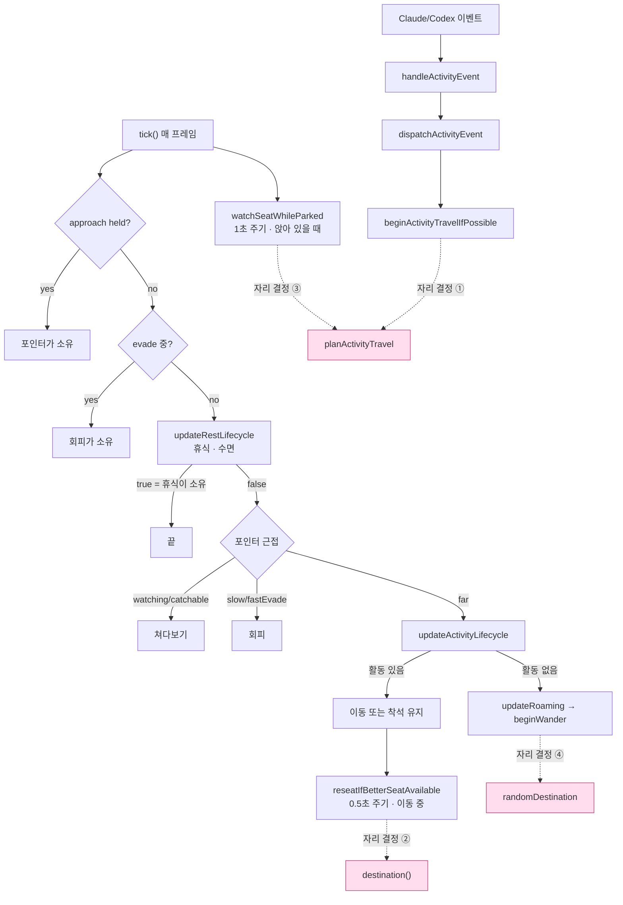
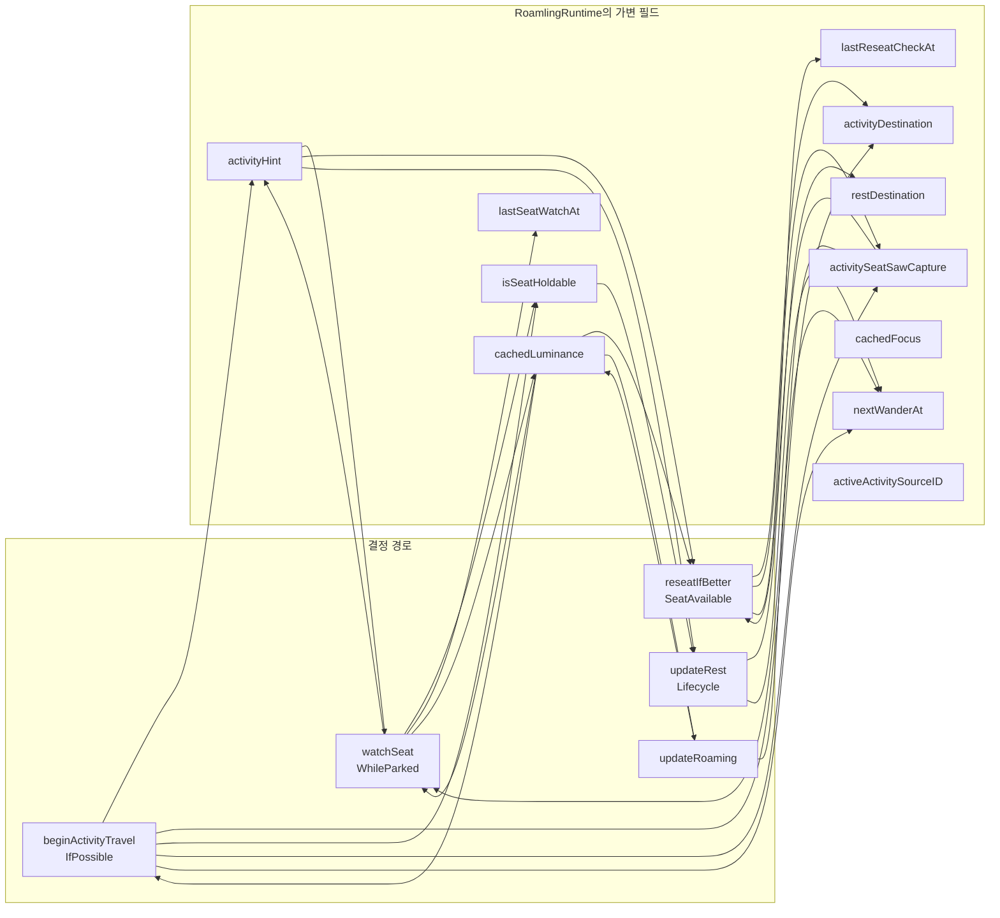
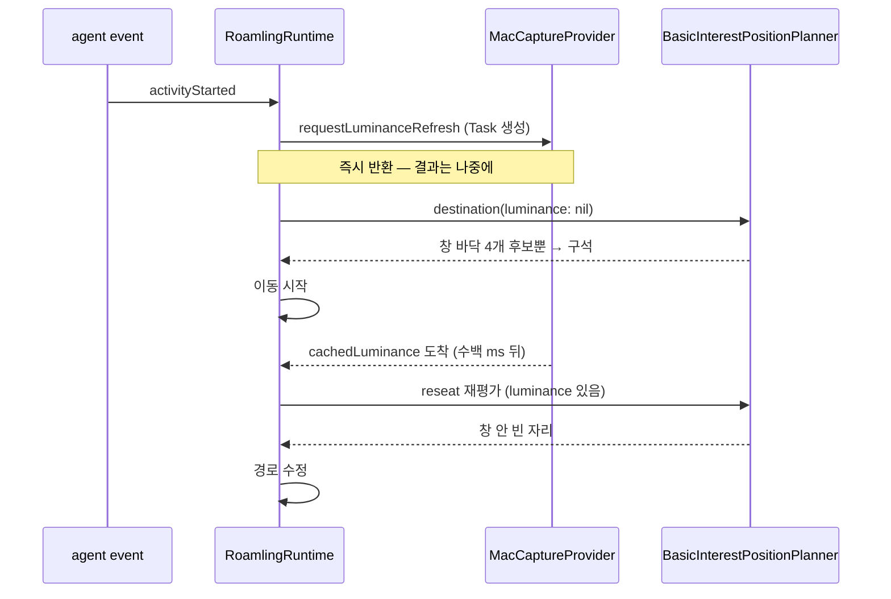
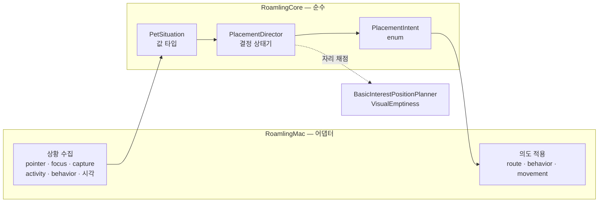
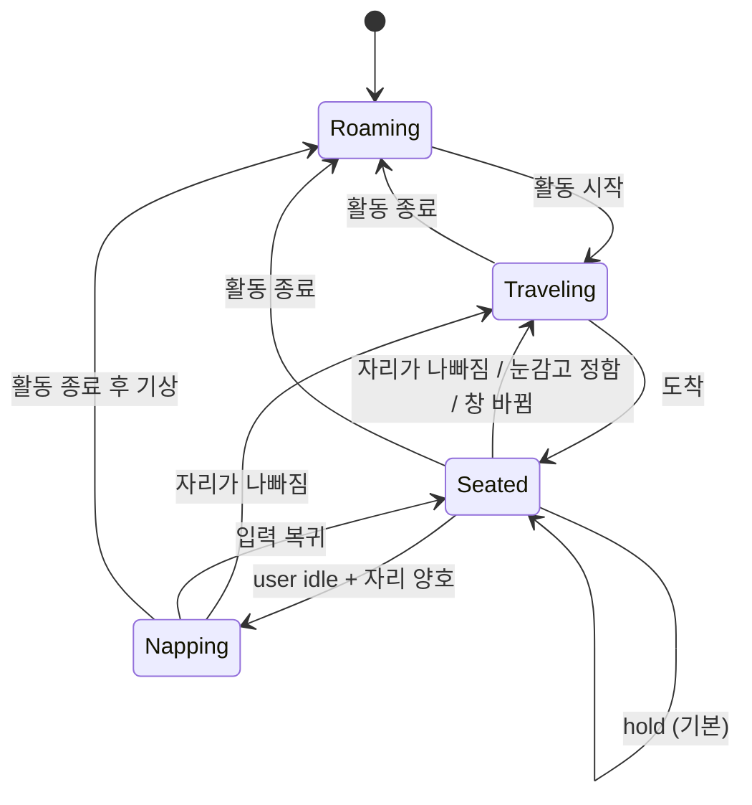

# Placement: where the pet decides to stand

`docs/architecture.md`는 모듈 경계를, `docs/history/mvp.md`는 게이트를 설명한다. 이 문서는 그
사이에 빠져 있던 것을 다룬다 — **펫이 "어디에 있을지"를 정하는 결정이 실제로 어떻게
흐르는가**, 그리고 그 흐름이 왜 지금 형태로는 계속 버그를 만들어내는가.

MVP 4 게이트 안에서 발견된 결함 다섯 개가 전부 이 흐름에 있었기 때문에 만든 문서다.
1장은 재정비 전 구조, 2장이 진단, 3장이 그 진단대로 바꾼 **현재 구조**다. 1·2장을 남겨
두는 이유는 3장의 규칙마다 그것이 어떤 결함에서 나왔는지가 근거이기 때문이다. 상수 하나를
완화하기 전에 2장의 표를 먼저 읽는다.

### 모니터 사이 경계 (2026-09-17)

일반 커서 응시는 이제 멈춰 앉은 상태에서만 시작한다. 런타임의
`PetRuntime::finish_tick::allows_pointer_glance` 조건이 director에 넘기기 전에 이를 적용한다.
따라서 아래 3.2.2의 응시 우선순위는 **이미 앉아 응시 중인 펫을 출발시킬 때**의 규칙이고,
걷고 있는 펫을 커서 옆에 붙잡아 세우지는 않는다. 애정 키·회피·실제 잡기는 별도다.

- 연결된 모니터의 공유 가장자리는 정착 영역에서 120pt를 비운다. 좁은 화면에서는 해당
  축 길이의 1/4까지만 비우고, 여기에 각 planner의 펫 반 크기 여유가 더해진다.
  일부만 맞닿아도 그 가장자리 전체에 적용한다. 화면 바깥 가장자리, 모서리만 맞닿는 배치,
  미러링, 1pt보다 큰 빈 간격은 이 정책의 공유 경계가 아니다.
  근거: `rust/roamling-core/src/display_policy.rs::placement_frame`.
- 산책 후보, 작업 창 옆 좌석, 휴식 안전지대는 같은 배치 영역을 사용한다. 실제 `frame`과
  통행용 topology는 그대로이고, 휴식 직전에는 현재 자리가 공유 경계 여유 안인지도 확인한다.
  근거: `PetRuntime::random_wander_point`, `make_situation`, `begin_rest_travel`과
  `display_policy::placement_world`.
- 경계를 향한 다음 waypoint에 충분히 가까워지면 이웃 화면 안쪽 waypoint까지 이동을
  유지한다. 그 구간에는 커서 응시·회피·좌석 재평가가 경로를 끊지 않고, 실제 클릭으로
  잡기는 가능하다. 이벤트의 경로 취소도 통과를 막지 않는다. 안쪽에 들어온 뒤 평소 배치
  판단을 재개한다. 근거: `display_policy::crossing`, `PetRuntime::finish_tick`,
  `apply_activity`, `begin_catch`.
- 런타임은 중간 waypoint에서 정차용 감속을 하지 않고 최종 목적지에서 감속한다.
  근거: `MovementController::update_route`/`step`. 기존 `update`는 포팅 대조용 호출에
  남겨두며, 기존 differential fixture와 trace를 재생성하지 않는다.
- 회귀 검증: `pet_runtime::movement_policy_tests`의 네 방향 통과·경계 속도·클릭 중단·
  목적지 여유 및 `display_policy::tests`의 음수 좌표·엇갈린 화면·좁은 화면 검사.
  macOS의 실제 깜박임 감소는 다중 모니터에서 시각 확인이 필요하다.

## 1. 재정비 전 (as-is)

### 1.1 결정 지점이 네 개다

펫의 위치를 정하는 코드는 `RoamlingRuntime`(1617줄, 함수 60개) 안에 네 곳으로 흩어져
있다. 서로를 호출하지 않고, 각자 입력을 따로 모으고, 같은 가변 필드를 읽고 쓴다.



네 개의 결정 지점(분홍)이 서로 다른 규칙을 쓴다. ①②③은 `BasicInterestPositionPlanner`를
쓰고 ④는 `VisualEmptiness`만 쓴다. ④가 늦게 합류한 이유가 2.2에 있다.

### 1.2 우선순위가 두 곳에 따로 적혀 있다

위 그림에서 `watchSeatWhileParked`만 `tick()` 맨 위, **else-if 사슬 바깥**에 있다. 잠든
펫도 화면 변화를 알아채야 해서 그렇게 뒀는데, 그 결과 우선순위 표현이 두 벌이 됐다.

- 사슬 안쪽: catch → evade → rest → pointer → activity → roaming 순서
- 사슬 바깥: 자리 감시가 `pointerOwnedStates`라는 **별도 집합**으로 스스로 양보

두 규칙이 같은 것을 말하지 않는다. `approach_hold_until`(당시 `catchArmedUntil`)이 켜지는 tick에서는 behavior state가
아직 `.observe`라 감시가 통과하고, 같은 tick 뒷부분의 catch 분기가 방금 깐 경로를 취소한다.
한 tick짜리 창이라 증상은 작지만, **"누가 펫을 소유하는가"의 답이 두 군데 있고 서로
다르다**는 것이 문제다. 결함 5가 여기서 나왔다.

### 1.3 그 네 곳이 공유하는 가변 상태



읽는 쪽과 쓰는 쪽이 M:N이다. 어떤 경로가 어떤 필드를 세워야 하는지는 코드 어디에도
적혀 있지 않고, 빠뜨려도 컴파일러가 잡지 못하며, 대부분 순수 테스트로도 잡히지 않는다.

### 1.4 캡처와 focus는 비동기·캐시로 들어온다



측정값(실제 데스크톱, 1728×1117): 캡처 없이 계획하면 화면 왼쪽 끝에서 **66pt**, 있으면
**332pt**. 앞쪽 자리는 emptiness 0.51로 실제로 글자 위였다.

## 2. 여기서 나온 결함들

MVP 4 안에서 발견된 다섯 개는 서로 다른 증상이었지만 원인 형태가 같다 — **경로 A가
세워야 할 필드를 세우지 않았고, 경로 B가 그걸 읽는다.**

| # | 증상 | 원인 | 형태 |
|---|---|---|---|
| 1 | 세션 내내 화면 갱신에 무반응 | `planActivityTravel`이 false를 반환한 경로에서 `activityHint` 미설정 → `watchSeatWhileParked`가 영구 정지 | 플래그 누락 |
| 2 | 잘못된 자리에서 잠듦 | 도착 시 `isSeatHoldable = true`로 단정 | 검증 없는 낙관 |
| 3 | 구석에 고정 | 캡처 도착 여부를 기록하지 않아 눈감고 내린 결정이 hysteresis로 고정 | 결정의 출처 정보 소실 |
| 4 | 평상시 본문 위에 앉음 | 배회 경로가 다른 세 경로와 완전히 분리돼 emptiness를 아예 안 봄 | 규칙 이중화 |
| 5 | 커서 근처에서 판정 정지 | 이동 금지와 판정 금지를 같은 가드로 처리 | 관심사 혼합 |

### 2.1 순수 테스트가 잡지 못한다

1·2·3·5는 전부 상태 전이 타이밍 버그라 `RoamlingLogicTests`에서 재현할 수 없었다.
결정 로직이 `@MainActor` 클래스의 가변 필드에 얹혀 있고, 그 필드를 세우는 것이 부수효과이기
때문이다. 실제로 이 넷은 전부 **사용자가 앱을 실행해서 발견**했다. 이게 지금 구조가
치르고 있는 가장 큰 비용이다.

### 2.2 규칙이 두 벌 존재한다

MVP 4의 "빈 공간에 앉는다"는 규칙은 `BasicInterestPositionPlanner`에만 들어갔고, 배회
목적지는 `randomDestination()`이 별도 규칙으로 골랐다. 그런데 Claude Code는 턴마다
`Stop`을 쏘고 → `clearActiveActivity` → 2초 뒤 배회가 시작된다. 즉 **펫이 실제로 보내는
시간의 대부분이 규칙 바깥**이었다. 측정하니 무작위 목적지가 빈 자리에 앉을 확률은 49%였다.

### 2.3 좋은 자리에서도 계속 움직인다 (3.2의 5번으로 해결)

유지 판정이 임계치 하나(`holdEmptiness = 0.55`)이고 체류 시간 개념이 없다. 에이전트가
출력하는 동안 펫 밑 점수가 0.56 ↔ 0.54로 오가면 1초마다 자리를 옮기고, 옮길 때마다
"그 순간의 최선"을 새로 고르니 자리가 계속 튄다. 눈에는 멀쩡한 자리인데 24pt 셀 점수가
한 번 내려간 것이다.

`docs/architecture.md`의 `VisualSafeZoneProvider` 절은 이미 "dwell/hysteresis가 지나야
위치를 바꾼다"고 적어 두었다. 설계 의도는 처음부터 있었고 구현만 빠져 있었다 — 결정
지점이 네 개라 넣을 자리가 정해지지 않았기 때문이다. 지금 상태로 고치면 같은 히스테리시스를
네 곳에 네 번 넣게 된다.

## 3. 지금 구조

`Sources/RoamlingCore/PlacementDirector.swift`가 3장 전체다. 결정 표는
`PlacementDirector.decide(_:)` 하나에 우선순위 순서 그대로 들어가 있고,
`Tests/RoamlingLogicTests/CoreLogicTests.swift`가 각 행을 케이스로 고정한다.

### 3.1 결정을 한 곳으로



`RoamlingRuntime.tick()`은 **수집 → 결정 → 적용** 세 단계다 — `makeSituation` →
`placement.decide` → `apply`. 1.3의 17개 필드 중 배치 결정에 쓰이던 것은 director 안의
`seat` / `travel` 두 값으로 흡수됐고, 런타임에 남은 것은 어댑터가 원래 소유해야 하는
캐시(`cachedFocus`, `cachedLuminance`)와 배치 밖에서도 쓰이는 페이싱(`nextWanderAt`)뿐이다.

결정은 **소유권과 무관하게 매 tick 돌아간다.** 1·2번 우선순위는 `.none`을 돌려주지만
그 앞의 판정은 이미 끝나 있어서, 포인터가 손을 떼는 tick에 곧바로 최신 답으로 움직인다.
판정과 이동을 같은 가드로 막은 것이 결함 5였다.

**그래서 판정은 자기가 쓰는 상태를 소모하면 안 된다.** 버려질 답을 만드느라 타이머를
되감으면, 손을 떼는 tick에 남아 있는 것이 최신 답이 아니라 처음부터 다시 시작한 대기다.
10'번이 `parkedSince`를 이렇게 소모했다 — 3.2.1 참조.

### 3.2 결정 표

`PlacementDirector`가 답하는 질문은 하나다 — *지금 어디 있어야 하는가.* 우선순위 순으로
읽는다. 위쪽이 항상 이긴다.

| 우선순위 | 조건 | 의도 |
|---|---|---|
| 1 | 잡힘 / 끌림 | `.none` — 포인터가 소유 |
| 2 | 회피 중 | `.none` — 회피가 소유 |
| 3 | 이 소스에 대한 자리가 아직 없음 | `.travel(reason: .newActivity)` |
| 4 | 자리가 캐럿을 덮음 | `.travel(reason: .coveringCaret)` — 커서 응시에 양보하지 않는다 |
| 4' | **걷는 중** + 목적지가 커서의 `pointerClearance` 안 | `.travel(reason: .seatUnderPointer)` — 없으면 아래 fallback. 커서 응시에 양보하지 않는다 |
| 5 | 자리 emptiness < `abandonEmptiness` **그리고** 체류 시간 경과 | `.travel(reason: .coveringWork)` — 커서 응시에 양보하지 않는다 |
| 6 | 캡처 없이 정한 자리 + 캡처 도착 | `.travel(reason: .plannedBlind)` |
| 7 | 보는 창이 바뀜 | `.travel(reason: .followedFocus)` |
| 8 | 활동 중 + 자리 유지 가능 + user idle 경과 + **몸체가 내용과 안 겹침 + 공유 경계 여유 밖** | `.sleepInPlace` — 허가가 아니라 지시다. 휴식 층은 다른 곳을 찾지 않는다 (3.5) |
| 9 | 활동 중 + 자리 유지 가능 | `.hold` |
| 9' | 활동 없음 + 쉬는 중 | 휴식 단계에 따라 `.hold`(앉는 중) · `.sleepInPlace` · `.restAt(점)` · `.noRestSpot` — 잠자리는 여기서 정한다 (3.5) |
| 10 | 활동 없음 + 배회 시각 도래 | `.stroll(to:)` — 무작위 6개 + 디스플레이 격자 35개를 **여유 반경**으로 고른다(3.2.3). 커서를 가로지르는 길은 뺀다(3.2.4). 아무것도 깨끗하지 않고 지금 자리가 깨끗하면 `.hold`. 응시가 7초를 넘겼으면 `.escape`로 나간다(3.2.5) |
| 10' | 활동 없음 + 지금 자리가 덮임 | `.escape(to:)` — 후보와 선택은 같고, 커서에게 양보하지 않는다 |
| 11 | 그 외 | `.hold` |

**커서의 `pointerClearance`(회피가 켜져 있으면 인식 거리, 기본 170) 안에 있는 좌석 후보는
후보가 아니다.** 응시 대역이 걸음을 멈추므로 거기에는 도착할 수 없다 — 감점으로 두면 창이
작을 때 여전히 이겼다. 그래서 planner가 아예 빼고, 전부 막히면 `nil`을 돌려준다. 4'는 이미
걷고 있을 때만 켜진다: 앉아 있는 펫 옆을 지나는 커서는 응시이지 일어날 이유가 아니다.

떠날 이유는 있는데 정규 좌석이 없을 때의 fallback, 순서대로:

- a. clearance 밖 정규 좌석이 있고 `accepts`가 받으면 거기로.
- b. 없으면 **선 자리를 잰다.** 캐럿을 안 덮고 emptiness가 `holdEmptiness` 이상이면
  (창을 보고 있는지는 묻지 않는다 — 멀리서 지켜보는 것도 지켜보는 것이다) 4'일 때 그
  자리에서 `settle`. 4·5는 자리가 나쁘다는 것이 정의라 이 단계를 건너뛴다.
- c. 자리가 나쁘면 **비켜서기** — `stepAside`: 커서에서 펫 방향으로 clearance의 1.1배(기본
  187) 떨어진 점을 safe rect에 clamp한 것. 정규 좌석 선택에는 섞지 않는다(섞으면 평소 자리가
  달라진다). clamp 뒤에도 커서 안이면 `nil`. 그 점도 a와 같은 `accepts`를 통과해야 한다 —
  거리 조건과, 5에서는 대체 자리가 holdable이거나 점수 차가 `replacementMargin` 이상이라는
  조건.
- d. 그것도 없으면 4'는 그 자리에서 `settle`, 4·5는 예전처럼 hold로 떨어진다.

3·6·7은 자리 자체가 나쁜 것이 아니므로 정규 좌석이 없으면 예전처럼 hold(seat 기록)한다.

3번의 질문은 "펫이 그 창을 보고 있는가"다. 보고 있지 않으면 무조건 걸어간다 — 다른
디스플레이에 있는 경우가 대표적이고, 이건 점수로는 안 나온다. 실측하면 2번 모니터의
구석 자리가 1번 모니터의 깨끗한 자리를 **6.9점** 차이로 이기는데, 마진(15) 아래라
점수만 봤으면 엉뚱한 모니터에 눌러앉는다. 그래서 `watchesRegion`을 직접 묻는다.

이미 그 창을 보고 있다면, 새 자리가 마진만큼 확실히 나을 때만 옮긴다. caret이 있으면
끌림이 최대 40점이라 자동으로 넘고, 없으면 남는 건 하단 선호 12점뿐이라 자동으로 진다.
**"작업 위치를 못 찾으면 제자리 유지"가 조건문이 아니라 점수의 결과로 나온다.**

이게 필요한 이유는 Electron 앱이다. 실측(Paseo, `sh.paseo.desktop`)에서 AX가 주는
caret은 `(0, 33, 0, 0)` — 크기 0이라 `usableCaret`이 버린다. focused element는 화면
89% 지점의 입력창이다. 즉 창 안 어디가 작업 영역인지 알려주는 신호가 하나도 없고, 창은
전체화면이라 "창 하단"이 곧 "화면 하단 구석"이 된다. 신호가 없을 때 구석으로 걸어가는
것보다 서 있던 빈 자리에 있는 편이 낫다.

같은 소스의 두 번째 이벤트부터는 자리가 이미 있으므로 3번이 아예 켜지지 않는다 —
tool call마다 재계획하던 것이 여기서 끝난다.

한편 "보고 있다"의 범위(`holdRegionMargin`)는 **플래너가 창 옆에 앉히는 거리보다 넓어야
한다.** 창 밖 후보는 가장자리에서 `halfWidth + 14`(기본 펫 62pt)에 놓이는데 범위가
48pt 고정이면, 방금 고른 자리를 다음 판정에서 "이 창을 안 본다"고 판단해 또 옮긴다.
전체화면 창에서는 그 후보가 화면 밖으로 잘려 안 드러났다. 지금은 펫 크기에서 유도한다.

5번에 대해 이동한 뒤에는 최소 체류 시간(`seatDwell` 2.5초) 동안 5번이 다시 켜지지 않는다.
4번(캐럿)은 체류 시간을 기다리지 않는다 — 사용자가 방금 클릭한 자리를 2초 더 덮고 있는
것이 이 문서가 막으려는 바로 그 동작이다.

5번의 이탈 기준은 착석 기준과 **같은 `holdEmptiness`(0.55)다.** 더 낮은 이탈 기준을
한 번 넣어 봤고 실측으로 물렸다 — 4장의 probe로 실제 데스크톱(1728×1117)을 재보면
점수 분포가 이렇다.

| emptiness | 화면 비중 | 정체 |
|---|---|---|
| < 0.35 | 87 cell | 빽빽한 글자 |
| 0.35 ~ 0.55 | 28 cell | **성긴 글자 — 여전히 사용자의 작업물** |
| > 0.55 | 65 cell | 여백·벽지 |

이탈 기준을 0.35로 두면 가운데 구간이 통째로 "글자 위인데 앉아 있어도 되는 자리"가 된다.
화면의 15%다. 1.4의 실측(글자 위 자리 = 0.51)도 정확히 이 구간에 있다.

그래서 2.3의 진동은 기준을 낮춰서가 아니라 **원인 쪽에서** 막는다. 펫이 계속 움직였던
이유는 애매한 자리에서 **또 다른 애매한 자리로** 옮겼기 때문이다. 새 자리도 같은 줄에서
점수가 오르내리니 다음 판정에서 또 옮긴다. 그래서 5번은 새 자리가 **그 자체로 유지 가능할
때**(emptiness ≥ 0.55) 이동하고, 그렇지 않으면 `replacementMargin`(15점)만큼 확실히
나을 때만 이동한다. 같은 probe에서 깨끗한 자리는 0.973로 나온다 — 한 번 옮기면 다시
기준 아래로 내려올 일이 없으므로 이동이 한 번으로 끝난다.

실측으로 확인한 결과: 글자 위(0.525)에 앉힌 펫이 `coveringWork`로 0.973 자리로 옮기고,
정지 화면 20초 동안 추가 이동 0회.

### 3.2.1 배회 중에도 자기 자리를 본다

10번이 "배회 시각 도래"만으로 발동하던 동안, 펫은 **산책과 산책 사이 내내 눈을 감고
있었다.** 목적지는 emptiness로 골라 놓고, 앉은 뒤에 그 위로 글자가 차오르는 것은 아무도
안 봤다. 기본 `wanderPause` 12초면 8.4~17.4초, 사용자가 40초로 올리면 28~58초다.
배회를 조용하게 만들수록 글자를 오래 덮는 구조였다.

그래서 10번은 자리가 덮여도 발동한다. 5번과 같은 기준을 그대로 쓴다 — `holdEmptiness`
아래로 내려가고, `seatDwell`이 지났고, **갈 곳이 그 자체로 깨끗할 때만.** 규칙을 새로
만들지 않는 것이 2.2의 교훈이다.

걷는 중이거나 자는 중이면 발동하지 않는다(`isWalking` · `isResting`). 각각 이미 다른
주인이 있는 상태라, 여기서 경로를 새로 깔면 그 주인과 싸운다.

캡처 주기는 6초다. 에이전트 자리(3초)의 절반인데, 스크롤에 가려지는 것은 급한 상황이
아니고 캐럿을 덮는 경우는 4번이 즉시 처리하기 때문이다. 실측으로 캡처 1회가 **62ms**
(median 61.5, n=20)라 6초 주기는 시간의 1.03%다. 3초로 올리면 2.06%가 된다.

실측 확인: 배회 타이머를 끈 채로 화면에서 가장 빽빽한 지점(emptiness 0.000)에 펫을
앉히면 `seatDwell` 직후 0.706 자리로 한 번 이동하고 멈춘다.



### 3.2.2 커서는 이 걸음을 못 막는다

10'번은 `.stroll`이 아니라 `.escape`다. 둘은 목적지를 고르는 방식이 같고 **누구에게
양보하는지가 다르다.**

커서를 쳐다보려고 멈추는 것은 순간이고, 사용자의 글자를 깔고 있는 것은 상태다. 순간이
상태의 해결책을 취소하면 안 된다. 실제로는 지연보다 나빴다 — 응시가 경로를 취소하기
때문에(`movement.cancelRoute`), 펫은 커서가 붙잡은 그 자리에 서 버렸고 그 자리는 방금
떠나던 문단 한가운데였다.

세 군데가 같이 고장나 있었다.

1. **판정이 사라졌다.** `decide`는 포인터가 펫을 소유하는 동안 모든 답을 버리는데,
   10'번이 답을 만들면서 `parkedSince`를 비웠다. 커서가 옆에 머무는 한 대기는 성숙할
   때마다 되감겼고, 펫은 커서가 치워질 때까지 글자 위에 있었다. 이제 `parkedSince`는
   실제로 걷기 시작할 때(`isWalking`) 비워진다.
2. **경로가 취소됐다.** 이제 응시를 무시하는 걸음(`.escape`, 그리고 아래 정의의
   `.travel`)이 살아 있는 동안 바깥 대역은 tick을 가져가지 못한다. 런타임의
   `walk_outranks_glance`(`pet_runtime.rs`)가 `PlacementIntent::outranks_glance`를 보고 판단한다.
3. **걸음을 시작하지도 못했다.** 커서가 **이미** 옆에 서 있으면 펫은 응시 상태고,
   `wanderEntryStates`가 그 상태에서의 `.beginWander`를 거절했다. 즉 이동 중에 끊기는
   경우를 고쳐도, 정지한 채로 덮이는 경우는 그대로 남았다 — 그리고 이쪽이 더 흔하다.
   펫이 글자 위에 있다는 건 거기가 사용자가 작업하는 곳이라는 뜻이고, 그러면 커서도
   거기 있다.

이 세 번째가 소유권 모델을 갈랐다. `PetSituation`의 포인터 신호는 이제 둘이다.

| 신호 | 뜻 | 배치가 지는가 |
|---|---|---|
| `isPointerOwned` | 잡힘·끌림·회피, 또는 손이 닿는 거리(≤100px, `catchable`) | 항상 진다 |
| `isPointerWatching` | 바깥 대역(100~170px) 응시 | 응시를 무시하는 걸음(`.escape`, `.travel(coveringCaret\|coveringWork\|seatUnderPointer)`)에만 진다 |

`wanderEntryStates`에 `.lookAtPointer`를 넣은 것도 이 갈래 때문이다. 응시 중에 배치가
내주는 경로는 응시를 무시하는 걸음뿐이므로(다른 답은 전부 `.none`이 된다), 그 상태에서
걸음을 허용해도 한가한 산책이 새어 나오지 않는다.

"응시를 무시하는 걸음"의 정의는 `PlacementIntent.outranksGlance` 하나다 — 배회의 `.escape`와,
활동 중 자리 감시가 내는 `.travel` 중 `PlacementTravelReason.keepsWalkingPastGlance`가 참인 것:
`.coveringCaret` · `.coveringWork` · `.seatUnderPointer`. 앞의 둘은 `.escape`와 같은 조건(펫이
사용자 작업 위에 있다)의 해결책이 이름만 다른 것이고, 셋째는 커서가 좌석에 앉아서 시작된
걸음이다 — 커서 때문에 떠나는 걸음이 커서를 보느라 멈추는 것은 자기모순이다. `decide`의 응시
게이트와 런타임의 `walk_outranks_glance`가 둘 다 이 정의를 본다. 처음에는 `.escape`만 있었고,
활동 중 글자 위에 놓인 펫이 떠나는 길에 커서를 만나면 응시가 경로를 취소해 글자 위에 그대로
앉았다(2026-09-09). 양보하는 것은 `.newActivity` · `.plannedBlind` · `.followedFocus` 셋 —
자리가 나빠서가 아니라 더 나은 자리로 가는 걸음이라서다.

**바깥 대역만 양보한다.** 회피와 잡기는 그대로 펫을 소유한다 — 하나는 펫을 옮기고
하나는 집어 올리므로, 둘 다 펫을 글자 위에 버려둘 수 없다.

활동 중의 걸음은 두 갈래로 커서를 다룬다. **목적지가 커서 옆이면 좌석을 그 대역 밖에서
고른다**(4') — 좌석이 커서 옆이면 펫은 170px 앞에서 서고, 커서가 조금 움직이면 같은 좌석으로
다시 출발하고, 다시 선다. 반복을 끊는 것은 8~12초 타임아웃뿐이었고, 그 뒤 review가 같은
좌석을 또 골랐다. **글자 위에서 벗어나는 걸음과 4'의 걸음은 응시를 무시한다**(위 정의) — 길에
커서가 있어도 멈추지 않고 지나간다. 3·6·7의 `.travel`은 앉아 응시 중이면 출발을 양보하되,
이미 걷기 시작했으면 일반 커서 응시로 중단하지 않는다. 커서를 끄고
오는 안은 버렸다 — 사용자의 포인터를 앱이 옮기는 것은 "Never annoying"에 어긋난다.

### 3.2.3 빈 공간의 가장자리가 아니라 가운데로

**2026-09-17 수정 전 재검증: 기존 여유 등급은 배회에만 적용되고, 글씨와의 최대 거리를
보장하지 않는다.** 작업 좌석은 몸체의 emptiness와 하단·캐럿 가점으로 결정하며
(`interest.rs::evaluate`), 휴식 안전지대는 화면 내용으로 후보를 검증하지 않는다
(`safe_zone.rs::destination`). 기존 동작을 바꾸지 않은 합성 격자 재현 결과:

| 검증 | 결과 | 근거 |
|---|---|---|
| 글자 바로 옆과 넓은 빈 곳 | 배회는 여유 1등급 대신 3등급을 선택 | `VisualEmptiness::most_comfortable` |
| 글자에서 몸체까지 152pt 대 652pt | 둘 다 3등급이므로 먼저 나온 152pt 후보 선택 | `CLEARANCE_SCALES = [1, 1.5, 2]`, 최고 등급이면 즉시 반환 |
| 작업 창 아래 글자 가까운 빈 곳 대 위쪽 넓은 빈 곳 | 몸체 점수는 둘 다 1.0. 여유 2등급의 하단 후보 76.000점이 3등급 후보 62.369점을 이김 | `BasicInterestPositionPlanner::destination`/`evaluate_seat` |
| 글자로 채운 우하단 모서리 대 빈 좌하단 | 휴식 목적지가 몸체 점수 0.0인 우하단. 1.0인 다른 모서리를 선택하지 않음 | `BasicSafeZonePlanner::destination` |
| 같은 입력을 실제 런타임에 전달 | 유휴 시간 1000초, 커서 멀리, 유효한 필드에서도 `(1152,704)`에서 `Sleep`, 몸체 점수 0.0 | `PetRuntime::begin_rest_travel`이 위 목적지를 받고 빈 경로이면 `enter_sleep` |

입력은 1280×800 화면, 펫 96×104, 실제와 같은 64×40 휘도 격자이며 글자 영역을
고대비 교대 패턴으로 표현했다. 실제 글꼴 인식률이나 macOS 화면 캡처를 검증한 것은 아니다.
재현 코드는 로컬 `output/text-clearance-audit.rs`, 출력은 `output/text-clearance-audit.txt`에 있다.
기존 emptiness·interest·placement·world differential 검증 네 묶음도 통과했다.

**같은 날 사용자 승인 후 적용한 런타임 규칙.** 배회·작업 좌석·휴식에 공통 `ClearanceMap`을
적용한다. 기존 휘도 격자의 각 셀 주변 3×3 영역을 기존 emptiness 함수로 판단하고, 0.55 미만인
영역을 내용으로 취급한다. 펫 몸체가 내용과 겹치는 후보는 제외하고, 남은 후보의 몸체에서 가장
가까운 내용 셀까지 거리를 잰다. 글꼴을 인식하는 OCR은 아니므로 사진·아이콘도 내용으로 잡히며,
격자가 놓치는 작은 글씨까지 완전히 피한다고 보장하지 않는다.

거리에는 기존 2배 몸체 크기 상한이 없다. **24pt 거리 구간 중 가장 여유가 큰 구간**을 고른 뒤에만
기존 하단·캐럿 근접·이동 거리 선호를 적용한다. 배회는 같은 구간에서 무작위 후보를 먼저 유지한다.
관측된 빈 후보가 있으면 캡처 밖 후보는 이기지 못한다. 관측된 후보가 전부 덮여 있으면 빈 후보가
없는 것으로 처리하며, 모든 후보를 관측할 수 없을 때만 기존 선호로 돌아간다.

배회는 기존 무작위 후보와 7×5 격자를 함께 비교한다. 빈 후보가 없으면 글씨 위로 산책하지 않는다.
작업 좌석도 같은 기준을 적용하며, 기존 0.5초 재평가·2.5초 체류·최소 이동 거리 조건을 유지한다.
현재 자리보다 여유가 24pt 이상 늘어날 때 재배치를 검토하므로 미세한 점수 변화만으로 옮기지 않는다.
캐럿을 덮는 작업 후보는 제외한다.

휴식은 모서리 외에 현재 화면의 7×5 격자도 비교한다. 현재 자리가 비어 있고 24pt 이상 개선할
후보가 없으면 그대로 잔다. 도착 직전과 수면 중 새 캡처에서도 내용 겹침을 재검사한다. 관측한
후보가 전부 덮여 있으면 잠들지 않고 30초 후 다시 시도한다. 수면 검사 캐시는 `set_luminance`
호출 때 무효화한다. macOS는 매 tick 필드를 전달하므로 Windows와 캐시 효과가 다르다
(`docs/maintenance-review.md`). 캡처 주기와 권한 요구는 그대로며 필드가 없으면 기존 무권한 배치를 유지한다.

변경은 `PetRuntime`이 쓰는 내부 플래너에 적용했다. 공개 저수준 플래너와 `PlacementDirector::new`
의 포팅 계약은 유지하여 기존 Swift/Rust differential fixture와 `RuntimeTrace.txt`를 바꾸지 않는다.
새 규칙은 `clearance_tests.rs`의 실제 런타임 테스트로 따로 검증한다: 기존 최고 등급 안에서 더 먼
자리 선택, 하단·캐럿 가점보다 여유 우선, 관측 밖 후보 처리, 도착 후 자리 유지, 글씨가 있는
잠자리 탈출, 전부 덮인 화면에서 휴식 보류, 이동 도중·수면 중 내용 변화, 캡처 없는 기존 배치.

### 3.2.4 커서를 가로지르는 길은 후보가 아니다

배회·탈출의 목적지에는 커서 항이 없었다. 활동 중 플래너만 `pointerClearance` 안의 좌석을
뺐고(3.2), 배회는 emptiness만 봤다. 그래서 탈출 목적지가 커서 너머면 펫은 응시 대역까지
걸어가 서고, 커서가 잡으면 회피하고, 풀리면 **같은 격자 지점을 또 골라** 커서 쪽으로 다시
걸었다(2026-09-10 실사용).

이제 무작위 후보와 격자 후보 모두 **펫에서 후보까지의 직선이 커서에 clearance보다
가까워지면 후보에서 뺀다**(`pathAvoidsPointer`). 목적지 자체가 커서 옆인 경우도 그 선분에
포함되므로 따로 볼 것이 없다. 펫이 이미 대역 안에 있으면 기준이 clearance가 아니라
**지금 거리**가 된다 — 곧장 멀어지는 길은 통과하고 더 가까워지는 길만 막혀서, 커서 옆에서
꼼짝 못 하는 일은 없다. 회피가 꺼져 있으면 clearance가 0이라 아무것도 안 막힌다.

캡처가 없을 때의 `.stroll(first)`도 같은 필터를 지난 첫 후보다. 전부 막히면 `.hold`이고
다음 tick에 새 무작위로 다시 묻는다. 경로는 `DisplayTopology`가 깔지만 여기서는 직선으로
근사한다 — 한 디스플레이 안에서는 같은 것이고, 디스플레이를 건너는 길은 커서에서 멀어질수록
근사가 틀려도 결과가 안 바뀐다.

시나리오는 `gen-director.swift`의 `roam-past-cursor`다.

### 3.2.5 오래 쳐다봤으면 간다

3.2.2의 "응시 상태에서 한가한 산책이 새어 나오지 않는다"는 커서가 **지나가는** 경우를
전제한 것이었다. 커서가 펫 옆에 그냥 놓여 있으면 펫은 응시가 풀릴 때까지 꼬리만
흔들었고, 그건 반응이 아니라 갇힌 것으로 보였다(2026-09-10 실사용).

director가 응시 시작 시각(`watchingSince`)을 들고, 응시가 `glancePatience`(7초) 이상
이어진 상태에서 나온 `.stroll`은 `.escape`로 바꿔 내보낸다. 이유는 둘이다 — escape는
런타임에서 응시가 경로를 못 끊는 걸음이고(`walk_outranks_glance`), 3.2.4의 경로 필터가
이미 후보를 **커서에서 멀어지는 길**로 좁혀 놓았다. 쳐다보다 흥미를 잃고 제 갈 길 가는
그림이다. 응시가 끊기면 시각이 지워져 다음 응시는 7초를 새로 센다. 100px 안(소유)은
그대로 전부 멈춘다.

이 걸음은 **커서에서 clearance의 2배(기본 340px) 안에서 끝나면 안 된다**
(`boredDistanceScale`). 멀어지는 방향이라도 30px 옮기고 서는 건 떠나는 게 아니라 뒤척이는
것이고, 응시 대역 바로 밖에서 서면 커서가 조금만 따라와도 같은 일이 반복된다. 후보 필터
(`pathAvoidsPointer`)가 지루해진 상태에서만 이 조건을 더한다.

시나리오는 `gen-director.swift`의 `roam-bored-glance`, 테스트는 "a long glance lets the
stroll go, away from the cursor".

### 3.3 이 구조가 막는 것

- **결함 1·3 유형** — hint와 결정 출처(`seat.sawCapture`)가 director 안에 있으므로,
  경로마다 세우고 빠뜨리는 일이 성립하지 않는다. 결정 경로가 하나뿐이다.
- **결함 4 유형** — 배회도 같은 결정 표(10번)를 지나므로 규칙이 두 벌 생기지 않는다.
  목적지를 고를 때뿐 아니라 이미 앉은 자리에도 같은 기준이 적용된다(3.2.1).
- **상수를 감으로 만지는 것** — 3.2의 표는 4장의 probe로 잰 값이다. 이탈 기준을 한 번
  낮췄다가 같은 probe로 되돌렸다. 이 문단이 그 기록이다.
- **결함 5 유형** — "판정"과 "이동"이 분리된다. 표는 항상 평가되고, 1·2번 우선순위가
  이동만 막는다.
- **2.1의 비용** — `PlacementDirector`가 순수 값 타입이라 결정 표 전체를 테스트로 고정할
  수 있다. 실행해야만 발견되던 타이밍 버그가 이제 `./scripts/test.sh`에서 잡힌다. 표의
  각 행에 케이스가 하나씩 있고, 결함 3·4·5는 재현 케이스로 남아 있다.

### 3.3.1 director가 자기 상태를 잃지 않는 방법

값 타입 상태기가 새로 만들 수 있는 고장은 "아무도 도착을 알려주지 않아서 영원히 걷는
중" 하나다. 그래서 도착은 통보가 아니라 **관측**이다 — `decide`가 매 tick 위치와 목적지
거리를 보고 `arrivalTolerance` 안이면 그 자리를 seat으로 삼는다. catch나 evade가 경로를
지워도 어댑터가 같은 목적지로 경로를 다시 깔기 때문에 이동이 이어지고, 그래도 끝나지
않으면 거리와 보행 속도로 계산한 timeout이 제자리 착석으로 되돌린다. 셋 다 director
안에 있어서 호출자가 잊을 수 있는 절차가 아니다.

### 3.4 건드리지 않는 것

pet 로딩·카탈로그, 애니메이션, 오버레이, 메뉴, 튜닝 창, 훅 인스톨러, 소스 어댑터.
`MovementController` · `BehaviorController` · `PointerInteractionModel`도 그대로 둔다 —
이미 순수하고 이번 결함들과 무관하다. catch/drag/evade 경로의 동작도 바꾸지 않는다.
`PlacementDirector`는 그 경로들이 활성일 때 `.none`을 돌려주고 비켜선다.

### 3.5 휴식과 자리를 한 층으로 (2026-09-19)

`docs/requests.md` R20 · B6 · B7. **코드에 들어갔다** — 지금의 동작은 3.2의 8 · 9'번과
`docs/behavior-flow.md` §3.1이 적고 있고, 이 절은 왜 그렇게 됐는지의 기록이다. 3.5.1 · 3.5.2는 고치기
**전**의 구조와 결함이고, 3.5.3 · 3.5.4가 지금 구조다. 남은 것은 3.5.5의 녹화 갱신 하나다.

#### 3.5.1 고치기 전 — "어디"에 답하는 곳이 둘이었다

3.1은 결정을 한 곳으로 모았다고 적었지만 **잠자리는 거기 들어오지 않았다.**

| 질문 | 자리 층 | 휴식 층 |
|---|---|---|
| 언제 | 재평가 0.5초 · 체류 2.5초 (`PlacementConfiguration::default`) | idle 75초 · sit 2.4초 · 입력 0.8초/커서로 기상 (`rest.rs` `update_rest_lifecycle`, `pet_runtime.rs` `SITTING_DURATION`) |
| 어디 | agent 창 주변 좌석 (`PlacementDirector::destination` → `interest.rs` `clear_destination`) | 화면 모서리 + 7×5 격자 (`rest.rs` `begin_rest_travel` → `safe_zone.rs` `clear_destination`) |
| 지금 자리가 나빠졌나 | 몸체 emptiness < 0.55, 또는 여유가 24pt 이상 나은 좌석이 있음 (`departure_reason`) | 몸체가 내용 셀과 겹침 (`rest.rs` `rest_spot_is_busy` → `defer_rest`) |

두 층이 서로에 대해 아는 것은 두 가지뿐이다.

- director → 휴식: `SleepInPlace`. 휴식 층은 이것을 **허가**로만 읽는다 — `update_rest_lifecycle`의
  `may_nap_on_seat`는 "쉬기 시작해도 된다"이지 "여기서 자라"가 아니다. 캡처가 있으면
  `begin_rest_travel`은 제자리 지름길을 건너뛰고(`self.luminance.is_none()` 조건) 잠자리를 따로 고른다.
- 휴식 → director: `PetSituation::is_resting`. 읽는 곳은 `stroll_verdict` 하나다. **agent 좌석
  경로(`verdict`)는 이 값을 보지 않는다.**

#### 3.5.2 그래서 나는 결함

- **B6 핑퐁.** 휴식 층이 낸 걸음은 `self.travel`에 없으므로 director는 목적지가 아니라 걷는 도중의
  위치를 채점하고(`verdict`의 `judged`), 24pt 벗어나면 `CoveringWork`로 되돌린다. 이동 의도는 휴식을
  무조건 취소한다(`finish_tick`의 `intent.travel_reason().is_some() && is_resting`). 6초 주기, 멈출 조건
  없음. 로그와 원인 사슬은 `docs/requests.md` B6.
- **같은 뿌리의 느린 판 (코드로만 확인, 로그에서는 못 봤다).** "자도 되는 자리"의 기준이 둘이라
  director는 유지 가능(몸체 평균 ≥ 0.55)이라 하고 휴식 층은 busy(내용 셀 하나와 겹침)라 하는 자리가
  있을 수 있다. 그러면 `SleepInPlace` → sit → `enter_sleep`이 busy로 `defer_rest` → 30초 뒤 다시,
  를 자리가 바뀔 때까지 되풀이한다.
- **B7.** director가 더한 격자 후보(`sweep`)는 런타임의 "선 자리는 목적지가 아니다" 거름
  (`roaming.rs` `stroll_candidates`)을 지나지 않는다. 규칙이 director 밖에 있어서 director가 새로
  만든 후보에는 닿지 않았다 — 2.2 "규칙이 두 벌"과 같은 모양이다.

#### 3.5.3 지금 구조 — 휴식은 "언제", director는 "어디"

```text
휴식 층 (rest.rs)                      director (placement.rs)
  idle 75초 · 커서 멀리 · 이동 중 아님      PetSituation.is_resting + 휴식 단계를 받는다
  sit 2.4초                               ├ 여기서 자라        SleepInPlace
  sit이 끝나면 director의 답을 따른다  ◀── ├ 저기 가서 자라     RestAt(point)      ← 새로
  입력 0.8초 · 커서 접근으로 기상          ├ 잘 곳이 없다       NoRestSpot         ← 새로
  wake 0.7초 → stretch 1.0초              └ 자리가 나빠졌다    Travel(reason)     (지금 그대로)
```

- 휴식 층에 남는 것: 진입 조건, sit·wake·stretch의 시간, 기상 조건, `rest_retry_at`(30초 재시도).
  **좌표를 고르는 코드는 남지 않는다.**
- director로 가는 것: `begin_rest_travel`의 목적지 선택, `enter_sleep`과 `Sleep` 상태의 busy 재검사.
  후보를 만드는 `BasicSafeZonePlanner::clear_destination`은 그대로 두고 부르는 곳만 옮긴다.
- 휴식 걸음도 director의 이동이 되므로 **목적지를 채점한다.** 핑퐁이 성립하지 않는다.
- 새 규칙은 전부 `keeps_clear()`(`PlacementPolicy::ClearOfContent`) 안에 둔다. `PortedContract`
  director와 FFI 레코드(`ffi/director.rs`)는 그대로다 — 새 입력은 FFI 변환에서 기본값을 받는다.

**agent를 지켜보는 동안의 규칙 (사용자 결정 2026-09-19: 자리에서 잔다).**

| 자리의 상태 | director의 답 | 펫 |
|---|---|---|
| 유지 가능 · 몸체가 내용과 안 겹침 · 공유 경계 여유 밖 · user idle | `SleepInPlace` | **그 자리에서 잔다.** 더 빈 곳이 멀리 있어도 가지 않는다 |
| 유지 가능하지만 몸체 밑에 내용 셀이 있음 | 더 나은 좌석이 창 주변에 있으면 `Travel(coveringWork)`(지금의 `departure_reason` 끝 분기), 없으면 `Hold` | 옮겨 앉아 거기서 자거나, **깨어서 자리를 지킨다** (열린 결정 ①) |
| 캐럿을 덮음 · emptiness 미달 · 창이 바뀜 | `Travel(reason)` — 지금 그대로 | 깨어서 옮기고, 도착한 자리가 첫 줄이면 다시 잔다 |
| 자는 중에 답이 `SleepInPlace`에서 `Hold`로 바뀜 | — | 깬다, 30초 뒤 재시도 (지금의 `defer_rest`와 같다) |

**agent가 없을 때의 규칙 — 동작은 지금과 같고 주인만 바뀐다.** 후보(모서리 + 7×5 격자), 24pt 개선
기준, 0.75배속 걸음, 도착·수면 중 재검사, 전부 덮였을 때의 30초 보류 — `docs/behavior-flow.md` §3.1의
표 그대로다.

#### 3.5.4 구현 명세 — 한 번에 한다 (사용자 결정 2026-09-19: "1,2 단계 합칠 수도 있을 것 같은데")

처음에는 agent 곁(결함을 닫음)과 agent 없음(구조를 끝냄)을 두 단계로 나눴다. 나눈 이유는
`RuntimeTrace.txt`를 한쪽에서만 건드리기 위해서였는데, 3.6의 기지개가 어차피 같은 녹화를 바꾸므로
나눌 이유가 없어졌다. **녹화는 한 번만 갱신한다.**

**타입.**

- `PetSituation`에 휴식 단계를 더한다 — `RestPhase { Awake, Settling, Seeking, Walking, Asleep }`.
  `is_resting`은 `PortedContract`가 읽으므로 그대로 둔다. `make_situation`이 `decide` **앞에서** 채운다:
  `Sit`이고 `SITTING_DURATION`이 안 지났으면 `Settling`, 지났으면 `Seeking`; `FindSleepSpot`이고 경로가
  남았으면 `Walking`, 경로가 없으면 `Seeking`(도착했다); `Sleep`은 `Asleep`. 그래야 sit이 끝나는 바로
  그 tick에 답이 적용돼 지금과 시간이 같다.
- `PlacementIntent`에 `RestAt(point)`와 `NoRestSpot`을 더한다. **`travel_reason()`은 둘 다 `None`이다** —
  `finish_tick`의 "이동 의도는 휴식을 깨운다" 분기에 걸리면 안 된다. FFI 의도 코드
  (`ffi/director.rs`, 지금 0~5)에 6·7을 더하되 `PortedContract`는 내지 않는다. FFI의 `PetSituation`
  레코드는 바꾸지 않고 변환에서 `is_resting`으로 `RestPhase`의 기본값을 만든다.

**director (`placement.rs`, 전부 `keeps_clear()` 안).**

- agent 경로 `verdict`의 Priority 7 — `SleepInPlace`의 조건에 둘을 더한다: 몸체가 내용과 안 겹침
  (`ClearanceMap::distance(position) >= 0`, 잴 수 없으면 통과 — 지금 `rest_spot_is_busy`의 기준 그대로),
  공유 경계 여유 밖(지금 `begin_rest_travel`의 `away_from_seam`과 같은 식·같은 수). 못 채우면 `Hold`.
  더 나은 좌석으로 옮기는 것은 기존 `departure_reason`이 한다.
- agent 없는 경로 `stroll_verdict` — `is_resting`이면 `Hold`를 돌려주던 자리에서 단계로 가른다.
  `Settling`은 `Hold`. `Seeking`은 지금 `begin_rest_travel`이 하던 선택을 **같은 순서로**: 후보는
  `BasicSafeZonePlanner::clear_destination`(같은 인자 — `placement_world` + safe zones + focus +
  luminance), 선 자리가 비었고 24pt 이상 나은 후보가 없으면 `SleepInPlace`, 후보가 없으면 `NoRestSpot`,
  배회가 꺼져 있으면 제자리(busy면 `NoRestSpot`), 그 외 `RestAt(point)`. 고른 점은 director가 기억하고
  (`rest_walk`) `Walking` 동안 같은 `RestAt`을 되풀이한다 — **걷는 동안 다시 고르지 않는다**, 지금도
  그렇다. `rest_walk`가 있는 채로 `Seeking`이 오면 도착이다: 선 자리가 busy면 `NoRestSpot`, 아니면
  `SleepInPlace`. `Asleep`은 선 자리의 busy 검사만 — busy면 `NoRestSpot`. `Awake`가 되면 `rest_walk`를 지운다.
- busy 검사의 캐시(`rest_content_check`)와 리팩터 2(`ac685ec`)의 무효화 조건을 같이 옮긴다. 맥은 매
  tick 필드를 넘기므로 캐시 없이 옮기면 그때 잰 70배가 돌아온다(`docs/maintenance-review.md`).
- `comfortable` — 선 자리에서 `minimum_travel_distance` 안쪽인 후보는 버린다(무작위·격자 모두, B7).
  런타임의 기존 거름(`roaming.rs` `stroll_candidates`)은 난수 순서 때문에 그대로 둔다.

**휴식 층 (`rest.rs`).** `update_rest_lifecycle`이 `may_nap_on_seat: bool` 대신 의도를 받는다.

- 진입 조건은 그대로다 — agent를 지켜보는 중이면 `SleepInPlace`일 때만 쉬기 시작한다.
- sit이 끝난 tick: `SleepInPlace` → 그 자리에서 잔다. `RestAt(p)` → `SeekSleepSpot`, 0.75배속 경로.
  `NoRestSpot` → `defer_rest`. 그 밖(`None` — 포인터가 소유 중 등)은 sit을 이어 가고 다음 tick에 다시 묻는다.
- 경로가 끝난 **그 tick에** `PlacementDirector::rest_arrival`을 불러 선 자리를 재고 눕는다. 도착은
  `decide` 뒤(경로 갱신)에 일어나므로 다음 tick의 `decide`를 기다리면 눕는 것이 한 tick 늦어지고, 녹화의
  58.1초가 흔들린다. 갈 경로가 없을 때(이미 그 자리)도 같은 호출이다.
- 자는 중: `NoRestSpot`, 또는 agent 곁에서 `Hold`로 바뀌면 → `defer_rest`.
- `begin_rest_travel` · `rest_spot_is_busy` · `PetRuntime`의 `rest_destination` · `rest_content_check`는
  없어진다. `enter_sleep`은 검사 없는 전이만 남는다.
- 진단 `rest` 줄의 문구와 시점은 그대로 둔다(`sleeping in place, on a vetted seat`,
  `tucking into a safe zone, spot unvetted`, `no clear sleep spot, staying awake`). 녹화가 그 줄을 담고 있다.
- `describe`(`names.rs`)에 `rest at x,y`와 `no rest spot`을 더한다.

**회귀 테스트 — 실물 모양의 입력으로, 고치기 전 코드에서 실패하는 것을 먼저 확인한다.**

- B6: 캡처가 있고, agent 좌석은 유지 가능하고, 화면 다른 곳에 24pt 이상 더 빈 곳이 있다. 사용자 idle.
  기대: `sit → sleep`이 그 자리에서, 이후 60초 동안 `findSleepSpot`도 `travelToInterest`도 없다.
- 느린 핑퐁: agent 좌석의 몸체 평균은 0.55 이상인데 내용 셀 하나와 겹친다. 기대: 더 나은 좌석이
  있으면 한 번 옮겨 거기서 자고, 없으면 `sit`에 들어가지 않고 깨어 있다.
- B7: 격자점 위에 선 펫. 기대: 산책 의도의 목적지가 선 자리가 아니다.
- R10의 `clearance_tests.rs`는 같은 기대를 director를 거쳐 그대로 만족해야 한다 — 기대를 고치지 않는다.

#### 3.5.5 게이트

- differential fixture 10개 — 무변경이어야 한다. 새 규칙이 `ClearOfContent`에만 있는 이유다.
- `RuntimeTrace.txt` — **바뀐다. 어디가 바뀌어야 하는지 미리 적어 둔다** (사용자 승인 2026-09-19).
  ① 휴식 구간의 `place` 줄 — 지금은 47.5초의 `place hold`가 67.0초까지 이어지지만, 52.9초에
  `place rest at …`, 58.1초에 `place sleep in place`, 64.5초에 `place hold`가 생긴다. 그 구간의
  좌표·`pet`·`rest` 줄과 프레임은 그대로여야 한다. ② 3.6의 기지개 — 64.5초 `wake` 뒤 `stretch → idle`이 66.2초에서 0.9초
  늦어지고, 그 뒤의 첫 산책(67.0초)도 같이 밀린다. 난수 순서가 tick 수에 묶여 있으면 그 뒤가 전부
  달라질 수 있다. **이 둘로 설명되지 않는 차이가 있으면 갱신하지 않고 원인을 찾는다.**
- 갱신 절차는 0.6.5의 선례(`docs/runtime-trace-review-0.6.5.md`) — Windows에서는 녹화를 못 만든다
  (Swift 하네스가 만든다). `.github/workflows/record-runtime-trace.yml`이 제안 녹화를 산출하면 차이를
  사용자에게 보여 주고, 승인 뒤에 기준을 바꾼다. 통과시키려고 다시 만들지 않는다.

#### 3.5.6 같은 로그에서 본 것 — 결함이 아닌 것과 아직 모르는 것

- **승인 대기는 자는 펫을 깨운다. 설계다.** `CompanionEventKind::wakes_resting_pet`
  (`activity.rs`)이 `AttentionRequired` · `Achievement` · `Negative` · `Setback`만 깨우게 한다 —
  도구 호출마다 깨면 한 박자도 못 자기 때문이고, 주석이 그 이유를 적고 있다. 로그 33282~33575초에서
  Codex가 승인 대기와 작업을 오갈 때마다 `wake → waitingForUser → work → sit → sleep`이 20초 안팎으로
  열 번쯤 돈 것이 이것이다. 사용자가 자리에 없을 때(idle 75초 이상)도 깨울지는 열린 결정 ③.
- **이유가 안 보이는 기상 (미확정).** 같은 구간에서 반응 없이 `wake → stretch → idle → sit → sleep`만
  도는 곳이 있다(예: 33351.0, 33369.0, 33402.5초 — `work`로 돌아가 앉은 지 0.1~2초 뒤. 33323.0초는
  잠든 지 18초 뒤다). 입력이었다면
  `rest`가 `waiting for user idle`을 찍었을 텐데 `clear to rest`다. 어떤 이벤트가 `CancelRest`를 내고
  반응은 버려진 것으로 보이지만 로그만으로는 확정하지 못했다. R20과 섞지 않고 따로 본다.

#### 3.5.7 정해진 것 (사용자 2026-09-19: "너가 제안한거 다 승인할꺼긴한데")

1. 자리는 유지 가능한데 몸체 밑에 내용이 조금 있고 더 나은 좌석도 없을 때 — **깨어서 지킨다.**
   "글자 위에서 자지 않는다"는 R10의 요청이고, 깨어 있는 펫은 이미 그 자리에 앉아 있던 펫이라 더
   성가셔지지 않는다.
2. `RuntimeTrace.txt`의 `place` 진단 줄이 바뀌는 것 — **차이를 검토하고 갱신한다.** 오늘의 진단이
   `place` 줄 덕에 됐다. 휴식 걸음이 거기 안 찍혔기 때문에 "누가 걸음을 냈는가"를 코드에서 거꾸로
   찾아야 했다.
3. 사용자가 자리에 없을 때의 승인 대기 — **지금대로 깨운다.** 돌아온 사용자가 처음 보는 것이 "기다리는
   중"이어야 agent가 멈춰 있다는 것을 안다. 깨어난 뒤의 모양은 3.6이 바꾼다.

### 3.6 기지개는 끝까지 (2026-09-19)

`docs/requests.md` R21. 자리 결정은 아니지만 3.5와 같은 작업이고 같은 녹화를 바꾸므로 여기 둔다.
**코드에 들어갔다** — 지금의 동작은 `docs/behavior-flow.md` §3과 타이머 표, `docs/art/mochi-sheet.md`의
`stretching` 길이가 적고 있다. 3.6.1은 고치기 전이다.

#### 3.6.1 고치기 전 — 기지개는 누구든 끊었다

- 길이는 고정이다: `wake` 0.7초 + `stretch` 1.0초 (`behavior.rs` `timing::WAKE` · `STRETCH`,
  "Roamling's own numbers" — Petdex에 없는 말이라 우리가 정한다). 그림은 확장 `stretching` 8칸 ×
  0.212초 = 1.7초로 그 합에 맞춰져 있고, 두 상태가 한 capability라 한 번에 이어 재생된다
  (`roamling-pet/src/lib.rs`의 `stretching` 트랙과 그 위 주석, Swift 쪽은 `MascotPetFactory.swift`).
- **끊는 것 넷.** `BehaviorController::handle`은 잡힌 상태만 아니면 어느 상태에서든 전이를 받는다.
  1. 반응 — `BehaviorInput::Reaction`. 로그 2307.2초 `wake` → 2307.3초 `waitingForUser`. 깨운 이벤트는
     `pending`에 들어가 `Idle`을 기다리지만(`resume_pending_if_ready`), `wake`는 `is_resting`이 아니므로
     그사이 도착한 다음 이벤트는 곧바로 dispatch된다(`handle_event`).
  2. 커서 — `update_rest_lifecycle`이 커서 접근으로 휴식을 취소해 `Wake`로 보내고 `false`를 돌려주면,
     같은 tick의 커서 분기가 `BehaviorInput::Pointer`를 넣어 `LookAtPointer`나 `EvadePointer`로 덮는다
     (`handle_pointer`도 쉬는 펫을 `Wake`로 보낸 같은 호출에서 그렇게 한다). 코드로 확인했고 로그로는
     못 봤다 — 자리를 비운 사이의 로그라 커서가 없었다.
  3. 자리 이동 — `apply_intent`의 `BeginInterestTravel`. 로그 37438.3초 `wake` → 37438.5초 `travelToInterest`.
  4. 잡기 — `CatchBegan`. **이것만 남긴다.**

#### 3.6.2 규칙

**`Wake`와 `Stretch` 동안 펫을 가져갈 수 있는 것은 잡기뿐이다.** 나머지는 기지개가 끝나 `Idle`이 된
다음에 일어난다 — 버리지 않고 미룬다.

- 자는 펫을 깨우는 자리 이동(`finish_tick`의 `travel_reason().is_some() && is_resting` 분기)은 **깨우기만
  한다.** 예전에는 같은 tick에 걸음까지 시작해 `wake`가 0.2초 만에 `travelToInterest`로 덮였다. director는
  받아들여질 때까지 같은 이동을 되풀이하므로 걸음은 기지개 뒤에 시작된다.
- `finish_tick`의 else-if 사슬에서 `update_rest_lifecycle` **바로 다음**에 "일어나는 중" 분기를 둔다.
  경로를 비우고 `update_route`만 한다 — 의도도 커서도 적용하지 않는다. 그 자리여야 하는 이유: 휴식
  취소가 `update_rest_lifecycle` 안에서 일어나고 `false`를 돌려주므로, 그 tick의 나머지 분기(커서·의도)
  가 같은 tick에 `Wake`를 덮는다. 앞쪽의 `approach_held` 분기는 애정 키(`is_adored`)로도 열리므로
  **쉬는 중에도 일어나는 중에도** 닫는다 — 그 분기는 커서를 상태 기계에 바로 넣고, `Sleep`에서 그것은 한
  호출 안의 `Wake → LookAtPointer`다. 첫 구현은 일어나는 중만 닫았고 독립 검토가 이 구멍을 재현했다
  (애정 키 + 50pt까지의 빠른 접근).
- `ActivityDirector`에 넘기는 `is_resting`은 전부 "쉬는 중이거나 일어나는 중"으로 넘긴다
  (`handle_event` · `declare_state` · `expire_states` · `expire_silent` · `resume_pending_if_ready`).
  깨우는 이벤트는 `pending`으로 가서 `Idle`에 나온다. `CancelRest`가 한 번 더 나와도
  `cancel_rest_for_activity`가 쉬는 중이 아니면 아무것도 안 한다.
- **일상 진행은 그대로 두면 사라진다 — 이 문서의 첫 판이 여기서 틀렸다.** "버려지되 `recent`에 남아
  `sustain_on_seat`가 다시 입힌다"고 적었지만 `sustain_on_seat`는 `recent`가 아니라 `active_reaction`을
  입힌다. 승인 대기로 깬 펫이 기지개를 켜는 사이 agent가 승인을 받고 다시 일하면, `pending`에 남은 옛
  승인 대기가 `Idle`에 나와 **다음 이벤트가 올 때까지 기다리는 포즈로 서 있었다**(독립 검토가 재현).
  그래서 `pending`은 같은 source의 더 새 이벤트로 바뀐다 — 깨우지 않는 종류여도
  (`ActivityDirector::keeping_pending_current`). 포팅 대조군과 비교되는 기본값에서는 꺼져 있고 런타임이 켠다.
  기지개 중에 끝난 턴의 축하가 곧바로 다음 턴의 시작으로 덮일 수 있는데, 그것은 막지 않던 때에도 같았다.
  **`deliver_arrival_reaction`은 일어나는 중에 부르지 않는다** — 입히지 못해도 빚을 지워 버린다.
  위 분기가 `hold_seat`에 닿지 않게 하므로 따로 막을 것은 없고, 테스트로 고정한다.
- `BehaviorController`의 전이 규칙은 고치지 않는다. 포팅 대조군(`mechanics_differential.rs`)이 같은
  표를 보고 있고, 규칙을 거는 자리는 런타임으로 충분하다.

#### 3.6.3 길이 — 1.7초에서 2.6초로

사용자: "좀 길게 기지개 펴도 될 것 같아서". 칸을 새로 그리지 않고 **가장 늘어난 자세에서 머문다.**
기지개를 푸는 순간이 f4→f5이므로(`docs/history/mochi-v3-plan.md` "`stretching`") 정점은 f3·f4다.

| 칸 | f0 | f1 | f2 | f3 | f4 | f5 | f6 | f7 | 합 |
|---|---|---|---|---|---|---|---|---|---|
| 지금 | 0.212 | 0.212 | 0.212 | 0.212 | 0.212 | 0.212 | 0.212 | 0.212 | 1.70 |
| 제안 | 0.212 | 0.212 | 0.212 | **0.500** | **0.700** | 0.300 | 0.232 | 0.232 | 2.60 |

- `wake`는 0.7초 그대로, `stretch`가 1.0 → 1.9초. 합이 트랙 길이와 같아야 한다 — 길면 마지막 칸에서
  멈춰 서고, 짧으면 기지개가 잘린다. **합이 같다는 것을 테스트로 고정한다.**
- 포팅된 `timing::STRETCH`는 그대로 두고 `BehaviorController`가 길이를 값으로 갖게 한다(기본 1.0,
  `PetRuntime`이 1.9로 만든다). `PlacementPolicy`와 같은 이유다 — 대조군은 옛 값으로 비교된다.
- 고친 곳 넷: `behavior.rs`(`timing::FULL_STRETCH`, `with_stretch_duration`) · `pet_runtime.rs`
  (`WAKE_WANDER_DELAY` 2.5 → 3.4 — 두 길이의 합 + 0.8초로 적어 기지개 뒤의 숨이 그대로다) ·
  `roamling-pet/src/lib.rs` `stretching_frames` · `MascotPetFactory.swift`(같은 여덟 값).
  디스크에서 읽는 펫 패키지는 자기 `roamling.json`의 시간을 쓰므로 트랙이 먼저 끝나 마지막 칸에 머문다 —
  깨지지 않는다.
- `WAKE_WANDER_DELAY`는 잠자리가 없어 휴식을 미룰 때(`defer_rest`)에도 쓰이므로, 그때의 다음 산책도
  0.9초 늦어진다.
- 내장 트랙은 이제 shipped `mochi-v3` 패키지의 매니페스트(1.70초)와 **일부러 다르다.** 매니페스트는
  `fps` 하나라 칸마다 다른 길이를 적을 수 없다. `PetLogicTests.swift`의 길이 고정 표가 그 차이를 주석과
  함께 2.60으로 적는다. 패키지 쪽을 맞추려면 `idle`처럼 칸을 반복해 적어야 한다 — 하지 않았다.
- **숫자는 보고 정한다.** 위 표는 첫 판이다.

#### 3.6.4 회귀 테스트

- 자는 펫 + `AttentionRequired`, **이어서 0.1초 뒤 같은 agent의 다음 이벤트**(실물은 늘 그렇게 온다).
  기대: `wake` 0.7 → `stretch` 1.9 → `idle` → `waitingForUser`. 고치기 전 코드에서 기지개가 잘리는
  것을 먼저 확인한다.
- 자는 펫 + 커서 접근. 기대: 기지개가 끝난 뒤에 `lookAtPointer`.
- 자는 펫 + director의 `Travel`(캐럿을 덮음). 기대: 기지개가 끝난 뒤에 출발.
- 기지개 중 잡기. 기대: 바로 `caught`.
- 기지개 중에 온 `Achievement`는 버려지지 않고 `idle` 뒤에 `celebrate`로 나온다.
- 승인 대기로 깬 뒤 기지개 중에 같은 agent가 다시 일한다. 기대: `idle` 뒤에 `work`, 기다리는 포즈가 아니다.
- 애정 키를 누른 채 멀리서 50pt까지 한 tick에 다가온다. 기대: 그래도 `wake → stretch`.

테스트는 `pet_runtime/rest_tests.rs`. **전부 고치기 전 코드에서 실패하는 것을 확인했다** — 처음 열은
저장소 밖 worktree의 `96b73c6`에 테스트만 옮겨서(잠자리 넷 · 기지개 다섯 · 트랙 길이 하나), 뒤의 둘은
첫 구현 위에서.

## 4. 진단 방법

배치가 이상할 때 상수부터 만지지 않는다. 실제 데스크톱 좌표와 실제 스크린샷으로 배포된
플래너를 그대로 돌려보는 것이 먼저다. `RoamlingCore`는 OS 비의존이므로 SwiftPM 산출물에
직접 링크해 재생할 수 있다.

```sh
swiftc -O probe.swift -I .build/debug/Modules \
    .build/debug/RoamlingCore.build/*.o -o probe
```

probe에서 `NSScreen`으로 디스플레이를, `CGWindowListCopyWindowInfo`로 전면 창 bounds를
읽고(둘 다 권한 불필요), `screencapture`로 받은 PNG를 `MacCaptureProvider`와 같은 방식으로
축소해 `LuminanceField`를 만든 뒤 `BasicInterestPositionPlanner.destination`을 호출한다.
캡처를 nil로 한 번, 채워서 한 번 돌리면 두 경우의 자리를 직접 비교할 수 있다.

이 방법으로 결함 3의 원인(66pt vs 332pt)을 확정했다. 그전 두 번은 합성 이미지로 상수를
추정했고 둘 다 빗나갔다.
