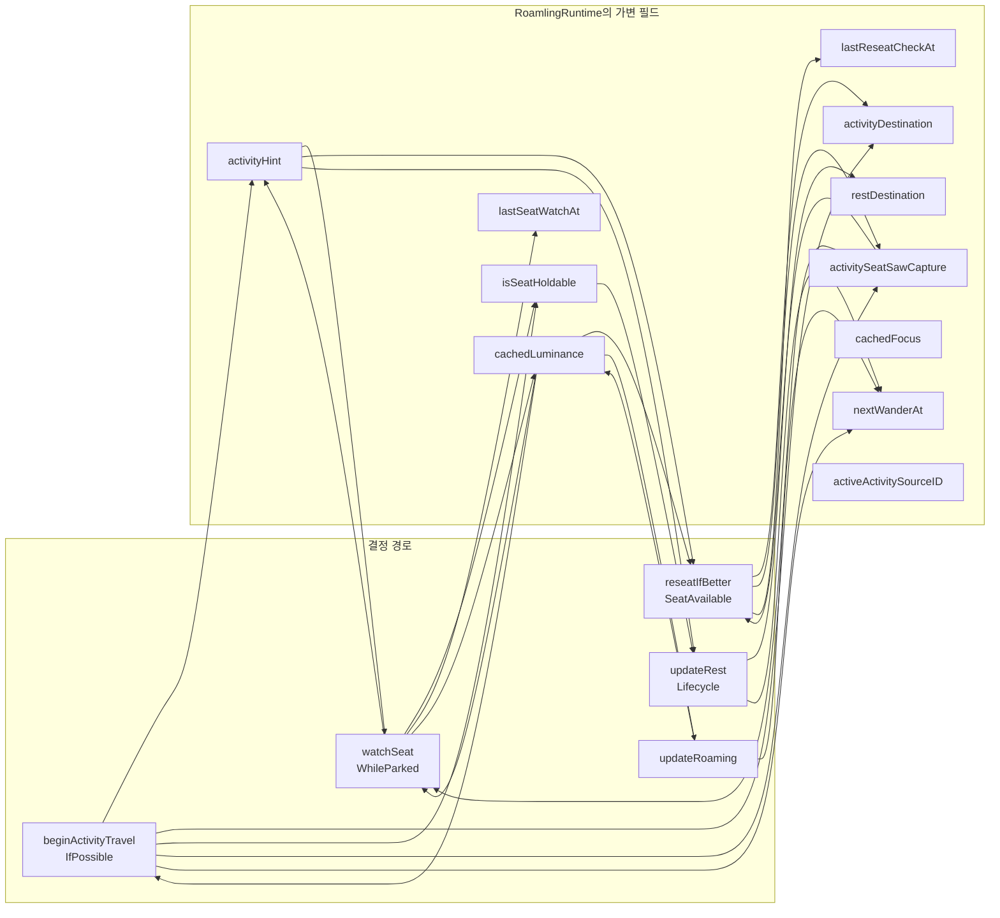
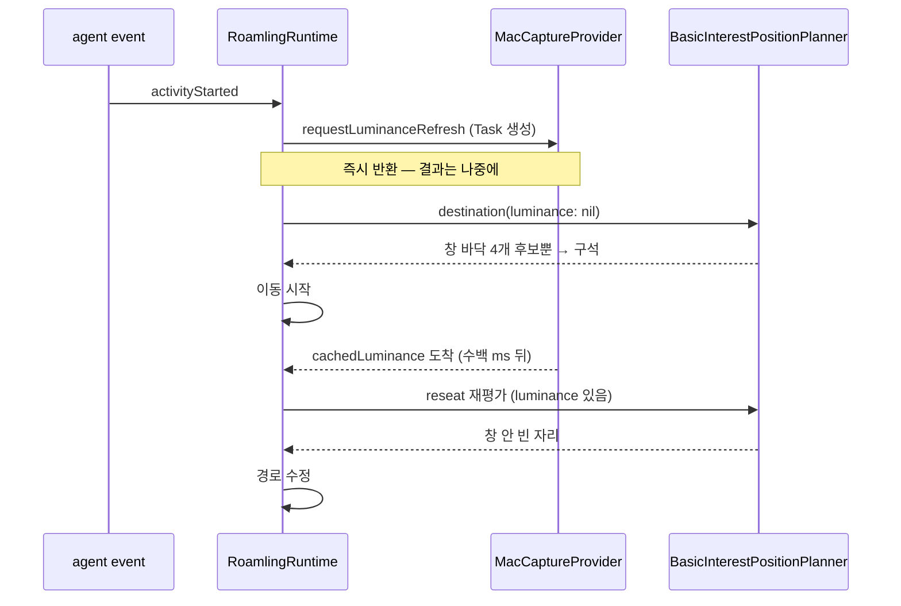
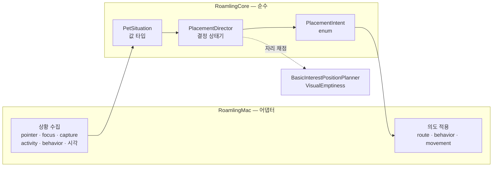
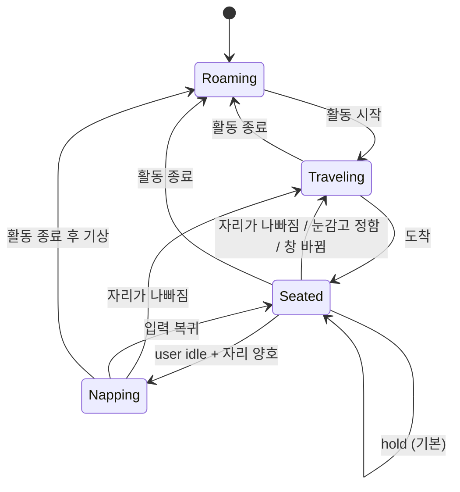

# Placement: where the pet decides to stand

`docs/architecture.md`는 모듈 경계를, `docs/mvp.md`는 게이트를 설명한다. 이 문서는 그
사이에 빠져 있던 것을 다룬다 — **펫이 "어디에 있을지"를 정하는 결정이 실제로 어떻게
흐르는가**, 그리고 그 흐름이 왜 지금 형태로는 계속 버그를 만들어내는가.

MVP 4 게이트 안에서 발견된 결함 다섯 개가 전부 이 흐름에 있었기 때문에 만든 문서다.
1장은 재정비 전 구조, 2장이 진단, 3장이 그 진단대로 바꾼 **현재 구조**다. 1·2장을 남겨
두는 이유는 3장의 규칙마다 그것이 어떤 결함에서 나왔는지가 근거이기 때문이다. 상수 하나를
완화하기 전에 2장의 표를 먼저 읽는다.

## 1. 재정비 전 (as-is)

### 1.1 결정 지점이 네 개다

펫의 위치를 정하는 코드는 `RoamlingRuntime`(1617줄, 함수 60개) 안에 네 곳으로 흩어져
있다. 서로를 호출하지 않고, 각자 입력을 따로 모으고, 같은 가변 필드를 읽고 쓴다.


네 개의 결정 지점(분홍)이 서로 다른 규칙을 쓴다. ①②③은 `BasicInterestPositionPlanner`를
쓰고 ④는 `VisualEmptiness`만 쓴다. ④가 늦게 합류한 이유가 2.2에 있다.

### 1.2 우선순위가 두 곳에 따로 적혀 있다

위 그림에서 `watchSeatWhileParked`만 `tick()` 맨 위, **else-if 사슬 바깥**에 있다. 잠든
펫도 화면 변화를 알아채야 해서 그렇게 뒀는데, 그 결과 우선순위 표현이 두 벌이 됐다.

- 사슬 안쪽: catch → evade → rest → pointer → activity → roaming 순서
- 사슬 바깥: 자리 감시가 `pointerOwnedStates`라는 **별도 집합**으로 스스로 양보

두 규칙이 같은 것을 말하지 않는다. `catchArmedUntil`이 켜지는 tick에서는 behavior state가
아직 `.observe`라 감시가 통과하고, 같은 tick 뒷부분의 catch 분기가 방금 깐 경로를 취소한다.
한 tick짜리 창이라 증상은 작지만, **"누가 펫을 소유하는가"의 답이 두 군데 있고 서로
다르다**는 것이 문제다. 결함 5가 여기서 나왔다.

### 1.3 그 네 곳이 공유하는 가변 상태



읽는 쪽과 쓰는 쪽이 M:N이다. 어떤 경로가 어떤 필드를 세워야 하는지는 코드 어디에도
적혀 있지 않고, 빠뜨려도 컴파일러가 잡지 못하며, 대부분 순수 테스트로도 잡히지 않는다.

### 1.4 캡처와 focus는 비동기·캐시로 들어온다



측정값(실제 데스크톱, 1728×1117): 캡처 없이 계획하면 화면 왼쪽 끝에서 **66pt**, 있으면
**332pt**. 앞쪽 자리는 emptiness 0.51로 실제로 글자 위였다.

## 2. 여기서 나온 결함들

MVP 4 안에서 발견된 다섯 개는 서로 다른 증상이었지만 원인 형태가 같다 — **경로 A가
세워야 할 필드를 세우지 않았고, 경로 B가 그걸 읽는다.**

| # | 증상 | 원인 | 형태 |
|---|---|---|---|
| 1 | 세션 내내 화면 갱신에 무반응 | `planActivityTravel`이 false를 반환한 경로에서 `activityHint` 미설정 → `watchSeatWhileParked`가 영구 정지 | 플래그 누락 |
| 2 | 잘못된 자리에서 잠듦 | 도착 시 `isSeatHoldable = true`로 단정 | 검증 없는 낙관 |
| 3 | 구석에 고정 | 캡처 도착 여부를 기록하지 않아 눈감고 내린 결정이 hysteresis로 고정 | 결정의 출처 정보 소실 |
| 4 | 평상시 본문 위에 앉음 | 배회 경로가 다른 세 경로와 완전히 분리돼 emptiness를 아예 안 봄 | 규칙 이중화 |
| 5 | 커서 근처에서 판정 정지 | 이동 금지와 판정 금지를 같은 가드로 처리 | 관심사 혼합 |

### 2.1 순수 테스트가 잡지 못한다

1·2·3·5는 전부 상태 전이 타이밍 버그라 `RoamlingLogicTests`에서 재현할 수 없었다.
결정 로직이 `@MainActor` 클래스의 가변 필드에 얹혀 있고, 그 필드를 세우는 것이 부수효과이기
때문이다. 실제로 이 넷은 전부 **사용자가 앱을 실행해서 발견**했다. 이게 지금 구조가
치르고 있는 가장 큰 비용이다.

### 2.2 규칙이 두 벌 존재한다

MVP 4의 "빈 공간에 앉는다"는 규칙은 `BasicInterestPositionPlanner`에만 들어갔고, 배회
목적지는 `randomDestination()`이 별도 규칙으로 골랐다. 그런데 Claude Code는 턴마다
`Stop`을 쏘고 → `clearActiveActivity` → 2초 뒤 배회가 시작된다. 즉 **펫이 실제로 보내는
시간의 대부분이 규칙 바깥**이었다. 측정하니 무작위 목적지가 빈 자리에 앉을 확률은 49%였다.

### 2.3 좋은 자리에서도 계속 움직인다 (3.2의 5번으로 해결)

유지 판정이 임계치 하나(`holdEmptiness = 0.55`)이고 체류 시간 개념이 없다. 에이전트가
출력하는 동안 펫 밑 점수가 0.56 ↔ 0.54로 오가면 1초마다 자리를 옮기고, 옮길 때마다
"그 순간의 최선"을 새로 고르니 자리가 계속 튄다. 눈에는 멀쩡한 자리인데 24pt 셀 점수가
한 번 내려간 것이다.

`docs/architecture.md`의 `VisualSafeZoneProvider` 절은 이미 "dwell/hysteresis가 지나야
위치를 바꾼다"고 적어 두었다. 설계 의도는 처음부터 있었고 구현만 빠져 있었다 — 결정
지점이 네 개라 넣을 자리가 정해지지 않았기 때문이다. 지금 상태로 고치면 같은 히스테리시스를
네 곳에 네 번 넣게 된다.

## 3. 지금 구조

`Sources/RoamlingCore/PlacementDirector.swift`가 3장 전체다. 결정 표는
`PlacementDirector.decide(_:)` 하나에 우선순위 순서 그대로 들어가 있고,
`Tests/RoamlingLogicTests/CoreLogicTests.swift`가 각 행을 케이스로 고정한다.

### 3.1 결정을 한 곳으로



`RoamlingRuntime.tick()`은 **수집 → 결정 → 적용** 세 단계다 — `makeSituation` →
`placement.decide` → `apply`. 1.3의 17개 필드 중 배치 결정에 쓰이던 것은 director 안의
`seat` / `travel` 두 값으로 흡수됐고, 런타임에 남은 것은 어댑터가 원래 소유해야 하는
캐시(`cachedFocus`, `cachedLuminance`)와 배치 밖에서도 쓰이는 페이싱(`nextWanderAt`)뿐이다.

결정은 **소유권과 무관하게 매 tick 돌아간다.** 1·2번 우선순위는 `.none`을 돌려주지만
그 앞의 판정은 이미 끝나 있어서, 포인터가 손을 떼는 tick에 곧바로 최신 답으로 움직인다.
판정과 이동을 같은 가드로 막은 것이 결함 5였다.

### 3.2 결정 표

`PlacementDirector`가 답하는 질문은 하나다 — *지금 어디 있어야 하는가.* 우선순위 순으로
읽는다. 위쪽이 항상 이긴다.

| 우선순위 | 조건 | 의도 |
|---|---|---|
| 1 | 잡힘 / 끌림 | `.none` — 포인터가 소유 |
| 2 | 회피 중 | `.none` — 회피가 소유 |
| 3 | 이 소스에 대한 자리가 아직 없음 | `.travel(reason: .newActivity)` |
| 4 | 자리가 캐럿을 덮음 | `.travel(reason: .coveringCaret)` |
| 5 | 자리 emptiness < `abandonEmptiness` **그리고** 체류 시간 경과 | `.travel(reason: .coveringWork)` |
| 6 | 캡처 없이 정한 자리 + 캡처 도착 | `.travel(reason: .plannedBlind)` |
| 7 | 보는 창이 바뀜 | `.travel(reason: .followedFocus)` |
| 8 | 활동 중 + 자리 유지 가능 + user idle 경과 | `.sleepInPlace` |
| 9 | 활동 중 + 자리 유지 가능 | `.hold` |
| 10 | 활동 없음 + 배회 시각 도래 | `.stroll(to:)` — 후보 6개를 emptiness로 거름 |
| 11 | 그 외 | `.hold` |

3번이 "펫이 이미 괜찮은 데 서 있으면 그냥 있는다"보다 위인 것은 의도다. 에이전트가 일을
시작하면 펫이 **그 창으로 걸어가는 것**이 이 기능의 전부이고, 우연히 점수가 나오는 자리에
서 있던 것은 그 창을 보고 있다는 뜻이 아니다. 같은 소스의 두 번째 이벤트부터는 자리가
이미 있으므로 3번이 켜지지 않는다 — tool call마다 재계획하던 것이 여기서 끝난다.

5번에 대해 이동한 뒤에는 최소 체류 시간(`seatDwell` 2.5초) 동안 5번이 다시 켜지지 않는다.
4번(캐럿)은 체류 시간을 기다리지 않는다 — 사용자가 방금 클릭한 자리를 2초 더 덮고 있는
것이 이 문서가 막으려는 바로 그 동작이다.

5번의 이탈 기준은 착석 기준과 **같은 `holdEmptiness`(0.55)다.** 더 낮은 이탈 기준을
한 번 넣어 봤고 실측으로 물렸다 — 4장의 probe로 실제 데스크톱(1728×1117)을 재보면
점수 분포가 이렇다.

| emptiness | 화면 비중 | 정체 |
|---|---|---|
| < 0.35 | 87 cell | 빽빽한 글자 |
| 0.35 ~ 0.55 | 28 cell | **성긴 글자 — 여전히 사용자의 작업물** |
| > 0.55 | 65 cell | 여백·벽지 |

이탈 기준을 0.35로 두면 가운데 구간이 통째로 "글자 위인데 앉아 있어도 되는 자리"가 된다.
화면의 15%다. 1.4의 실측(글자 위 자리 = 0.51)도 정확히 이 구간에 있다.

그래서 2.3의 진동은 기준을 낮춰서가 아니라 **원인 쪽에서** 막는다. 펫이 계속 움직였던
이유는 애매한 자리에서 **또 다른 애매한 자리로** 옮겼기 때문이다. 새 자리도 같은 줄에서
점수가 오르내리니 다음 판정에서 또 옮긴다. 그래서 5번은 새 자리가 **그 자체로 유지 가능할
때**(emptiness ≥ 0.55) 이동하고, 그렇지 않으면 `replacementMargin`(15점)만큼 확실히
나을 때만 이동한다. 같은 probe에서 깨끗한 자리는 0.973로 나온다 — 한 번 옮기면 다시
기준 아래로 내려올 일이 없으므로 이동이 한 번으로 끝난다.

실측으로 확인한 결과: 글자 위(0.525)에 앉힌 펫이 `coveringWork`로 0.973 자리로 옮기고,
정지 화면 20초 동안 추가 이동 0회.



### 3.3 이 구조가 막는 것

- **결함 1·3 유형** — hint와 결정 출처(`seat.sawCapture`)가 director 안에 있으므로,
  경로마다 세우고 빠뜨리는 일이 성립하지 않는다. 결정 경로가 하나뿐이다.
- **결함 4 유형** — 배회도 같은 결정 표(10번)를 지나므로 규칙이 두 벌 생기지 않는다.
- **상수를 감으로 만지는 것** — 3.2의 표는 4장의 probe로 잰 값이다. 이탈 기준을 한 번
  낮췄다가 같은 probe로 되돌렸다. 이 문단이 그 기록이다.
- **결함 5 유형** — "판정"과 "이동"이 분리된다. 표는 항상 평가되고, 1·2번 우선순위가
  이동만 막는다.
- **2.1의 비용** — `PlacementDirector`가 순수 값 타입이라 결정 표 전체를 테스트로 고정할
  수 있다. 실행해야만 발견되던 타이밍 버그가 이제 `./scripts/test.sh`에서 잡힌다. 표의
  각 행에 케이스가 하나씩 있고, 결함 3·4·5는 재현 케이스로 남아 있다.

### 3.3.1 director가 자기 상태를 잃지 않는 방법

값 타입 상태기가 새로 만들 수 있는 고장은 "아무도 도착을 알려주지 않아서 영원히 걷는
중" 하나다. 그래서 도착은 통보가 아니라 **관측**이다 — `decide`가 매 tick 위치와 목적지
거리를 보고 `arrivalTolerance` 안이면 그 자리를 seat으로 삼는다. catch나 evade가 경로를
지워도 어댑터가 같은 목적지로 경로를 다시 깔기 때문에 이동이 이어지고, 그래도 끝나지
않으면 거리와 보행 속도로 계산한 timeout이 제자리 착석으로 되돌린다. 셋 다 director
안에 있어서 호출자가 잊을 수 있는 절차가 아니다.

### 3.4 건드리지 않는 것

pet 로딩·카탈로그, 애니메이션, 오버레이, 메뉴, 튜닝 창, 훅 인스톨러, 소스 어댑터.
`MovementController` · `BehaviorController` · `PointerInteractionModel`도 그대로 둔다 —
이미 순수하고 이번 결함들과 무관하다. catch/drag/evade 경로의 동작도 바꾸지 않는다.
`PlacementDirector`는 그 경로들이 활성일 때 `.none`을 돌려주고 비켜선다.

## 4. 진단 방법

배치가 이상할 때 상수부터 만지지 않는다. 실제 데스크톱 좌표와 실제 스크린샷으로 배포된
플래너를 그대로 돌려보는 것이 먼저다. `RoamlingCore`는 OS 비의존이므로 SwiftPM 산출물에
직접 링크해 재생할 수 있다.

```sh
swiftc -O probe.swift -I .build/debug/Modules \
    .build/debug/RoamlingCore.build/*.o -o probe
```

probe에서 `NSScreen`으로 디스플레이를, `CGWindowListCopyWindowInfo`로 전면 창 bounds를
읽고(둘 다 권한 불필요), `screencapture`로 받은 PNG를 `MacCaptureProvider`와 같은 방식으로
축소해 `LuminanceField`를 만든 뒤 `BasicInterestPositionPlanner.destination`을 호출한다.
캡처를 nil로 한 번, 채워서 한 번 돌리면 두 경우의 자리를 직접 비교할 수 있다.

이 방법으로 결함 3의 원인(66pt vs 332pt)을 확정했다. 그전 두 번은 합성 이미지로 상수를
추정했고 둘 다 빗나갔다.
